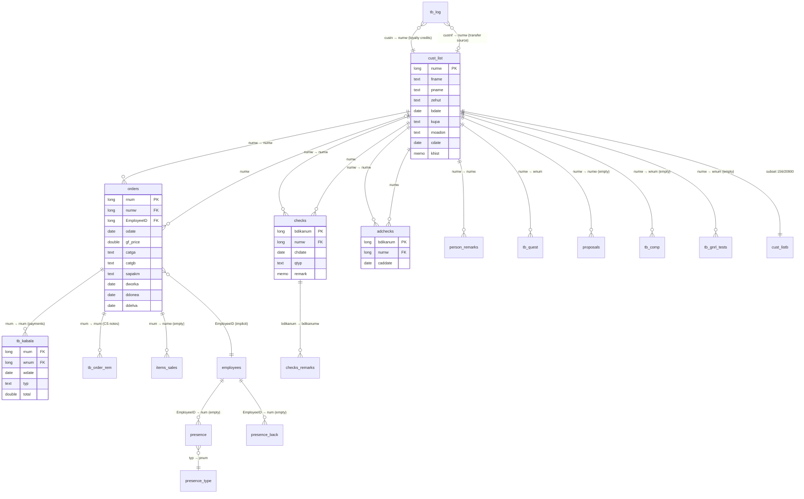

# דו"ח Audit לבסיס הנתונים של פריזמה ב-Access

**קובץ נסקר:** `tests/optic_dt.accdb` (25 MB)
**מצב חקירה:** Read-only. הקובץ המקורי לא נגעו בו.
**תאריך הדו"ח:** 2026-05-06
**מטרה:** מיפוי מלא של מה ש-Access מחזיקה היום, כבסיס לתוכנית cutover ל-OpticUp.

---

## 1. תקציר מנהלים

הקובץ אינו "Access של פריזמה" — הוא רק **המחסן** של Access. ה-Front-End (טפסים, דוחות, VBA, Queries) חי בקובץ נפרד שלא נסקר כאן. בקובץ הזה יש **רק נתונים**: 31 טבלאות, 758 עמודות, 14 קשרים מוגדרים, 9,805 הזמנות, 20,900 לקוחות, 6,248 בדיקות עיניים, 251 מרשמי-מגע, ו-7.1 מיליון ₪ הכנסות לאורך 5+ שנים.

הסיפור הגדול: **8 טבלאות ריקות לחלוטין** (פיצ'רים שתוכננו ולא יושמו — תורים, ספקים, עמלות, נוכחות, השוואות, בדיקות-כלליות, הצעות-מחיר), וכמה פיצ'רים שנוספו ממש לאחרונה — צבירת זיכויים (פברואר 2026), הערות-הזמנה (ינואר 2025). מנגד, **לוגיקה עסקית קריטית קבורה במקום אחד**: `doc_title` — טבלה עם 17 תבניות תקשורת WhatsApp/SMS שמניעות את כל זרם ההודעות. בלי לחלץ אותן, אנחנו מאבדים שנים של ניסוח.

הסיכון הגדול ב-cutover: **שמות שדות לא עקביים** (אותו מפתח לקוח נקרא `numw` בחלק מהטבלאות ו-`wnum` באחרות), **2 סיסמאות מאוחסנות בטקסט גלוי** (טבלאות `pass` ו-`passm`), ו-2,842 קבוצות לקוחות שחולקות מספר טלפון (חלקם משפחות, חלקם כפילויות אמיתיות שצריך לתקן לפני המעבר).

---

## 2. מתודולוגיה והגבלות

### איך נחקר הקובץ
- חיבור Read-only דרך **DAO 12.0 COM (32-bit)** + **ODBC ACCDB driver (32-bit)**.
- DAO סיפק את: TableDefs, QueryDefs, Relations, Indexes, Documents (containers).
- ODBC סיפק את: שאילתות מצרפיות (counts, distinct, fill rates, date ranges).
- כל הפלט הגולמי ב-`__LAUNCH_PLAN_DRAFT__/access-audit/_data/` (~30 קובצי JSON), הסקריפטים ב-`_tools/`.

### מה נחסם ולמה
- **`MSysObjects` נעול לקריאה דרך ODBC** (הגנה ברירת-מחדל של Access — דורש פתיחה ידנית מתוך Access UI). לא חצינו את החסימה כי משמעות זאת שינוי הגדרות בקובץ — בניגוד ל-read-only.
- **0 QueryDefs בקובץ הזה.** זאת אינדיקציה חד-משמעית: הקובץ הוא **back-end נתוני בלבד**. בארכיטקטורת Access נפוצה (Front-End / Back-End split), כל הטפסים, הדוחות, ה-VBA וה-Queries יושבים ב-`.accde`/`.mdb` נפרד שמתחבר לקובץ הזה דרך linked tables. **הקובץ הזה לא נותן גישה ללוגיקה העסקית**. זה הממצא הכי חשוב בדו"ח.
- **0 Forms / Reports / Modules / Macros** ב-DAO Containers — מאששים את אותה מסקנה.

### מה לא נכלל בדו"ח (פרטיות)
- אין שמות לקוחות, טלפונים, אימיילים, ת"ז, כתובות ספציפיות.
- אין ערכי מרשם (sphere/cylinder/axis/add/PD).
- אין תוכן free-text של הערות לקוח/הזמנה (רק spec של מבנה ושיעור-מילוי).
- מספרי לקוח אטומיים (numw) לא מופיעים בדוגמאות; כל הספירות מצרפיות.

---

## 3. תמונת המאקרו

### גיל הקובץ
- טבלאות נוצרו בין **2000 ל-2025**.  
  `cust_list` (טבלת הלקוחות) — נוצרה **2000-05-07**. זאת **הליבה ההיסטורית** של פריזמה.  
  `tb_log` (יומן צבירה) — נוצרה **2026-02-23**. זאת **התוספת האחרונה**.
- אבל **הנתונים** (לא ה-schema) מתחילים רק ב-**2021-01-05**. זאת אומרת:
  - או שיש **פעולת ארכוב** של ההיסטוריה (מה שהיה לפני 2021 חי בקובץ אחר)
  - או שיש מדיניות retention של 5 שנים
  - מומלץ לאתר את הקובץ הקודם **לפני** ה-cutover — שם הסטוריית הלקוחות, ההזמנות והבדיקות מ-2000–2020.

### כמות נתונים פעילה (2021–2026)

| מדד | ערך |
|---|---|
| לקוחות (`cust_list`) | **20,900** |
| הזמנות (`orders`) | **9,805** |
| בדיקות-עיניים (`checks`) | **6,248** |
| מרשמי-מגע (`adchecks`) | **251** |
| קבלות / תשלומים (`tb_kabala`) | **9,828** |
| הכנסה כוללת (sum tb_kabala.total) | **~7,121,063 ₪** |

### לקוחות פעילים מול לקוחות-בעבר
- 5,028 לקוחות (24%) ביצעו **לפחות הזמנה אחת אי-פעם** ב-DB הזה.
- 2,915 לקוחות (14%) ביצעו הזמנה ב-**24 החודשים האחרונים**.
- כלומר: **76% מ-cust_list הם לידים/דורמנטים** (לא קנו אף פעם או שלא קנו ב-2021-2026).

### היקף עסקי שנתי
| שנה | הזמנות | קבלות | סכום ₪ |
|---|---:|---:|---:|
| 2021 | 1,485 | 1,058 | 821,352 |
| 2022 | 1,417 | 1,589 | 1,156,220 |
| 2023 | 1,398 | 1,536 | 1,086,114 |
| 2024 | 2,095 | 2,210 | 1,589,259 |
| 2025 | 2,489 | 2,493 | 1,689,898 |
| 2026 (חלקי) | 919 | 940 | 774,570 |

הזמנה ממוצעת: **~720 ₪**. מגמת צמיחה ברורה החל מ-2024 (אחרי שנים של פלטו).

---

## 4. מפת ישויות

הערה: `||--||` = 1:1, `||--o{` = 1:N, `}o--||` = N:1, `}o--o|` = N:0..1.

### לקסיקון מפתחות (חשוב!)
שמות השדות בקובץ **לא עקביים**. אותו רעיון לוגי = שם שונה לפי הטבלה:

| מושג | שם בקובץ |
|---|---|
| מזהה לקוח (PK) | `numw` ב-`cust_list`, אבל גם `wnum` ב-`tb_quest`, `tb_comp`, `tb_gnrl_tests`, `tb_date_list`, `tb_kabala`, `tb_order_rem`, `tb_q_checks`, `tb_hsapakim` |
| מזהה הזמנה (PK) | `rnum` ב-`orders`, גם `rnum` ב-`tb_kabala`/`tb_order_rem`/`tb_log`, אבל `numw` ב-`items_sales` |
| מזהה בדיקה | `bdikanum` ב-`checks`/`adchecks`, אבל `bdikanumw` ב-`checks_remarks` |
| מזהה עובד | `EmployeeID` ב-`employees`, אבל `num` ב-`presence`/`presence_back` |
| תאריך פעולה | `wdate`, `datew`, `chdate`, `caddate`, `odate`, `cdate` — לא עקבי |

זה **סיכון ראשון במעלה ל-cutover**: כל סקריפט מיגרציה חייב טבלת תרגום שמות מפורשת.

---

## 5. הישויות הראשיות — חקר Per-Table

### 5.1 לקוחות וליבת ה-CRM

#### `cust_list` — טבלת הלקוחות הראשית (20,900 שורות, 66 עמודות, נוצרה 2000)

זאת ה-טבלה. המפתח (`numw`) מנהל את כל הקשרים. 66 עמודות מתחלקות ל:

- **PII בסיסי:** `fname`, `pname` (שם פרטי/משפחה), `zehut` (ת"ז), `bdate` (יום הולדת), `min` (מין), `address`, `city`, `email`, `tel`, `sel` (נייד), `ocupation` (מקצוע).
- **קופת חולים + מקור:** `kupa` (קופה), `mkor` (מקור הלקוח), `kamp` (קמפיין), `yeda` (סוג ידיעה), `sendb` (האם לשלוח).
- **מועדון/חברות:** `moadon` (קוד מועדון), `qhaver` (סטטוס חבר VIP), `kupon` (קופון), `cadsh`/`cmsgr` (יתרות זיכוי?), `fwdateh`/`twdateh` (תוקף חברות), `cust_open` (לקוח פעיל), `hvshin`/`hvshinm`/`hvshdate` (הנחות חבר).
- **מרשם משוקלל:** `nrop`/`nlop` (סוג עדשת ימין/שמאל), `nrmm1`/`nrmm2`/`nrdd1`/`nrdd2`/`nlmm1`/`nlmm2`/`nldd1`/`nldd2` (פרמטרים אוקולומטריים — pupillary distance maybe).
- **תאריכים:** `cdate` (יצירה), `chdate` (בדיקה אחרונה?), `insdate`/`cleandate`/`kupadate` (ביטוח/ניקוי/קופה), `colv` (?), `kupadate`.
- **יומן חופשי:** `khist` (Memo — היסטוריית קשר), `remark`/`dremark` (הערות).
- **מקטעי שיווק:** `swd`/`swb`/`aswb` (שלוש בוליאניות — מנויים?), `msgdone` (הודעה נשלחה).

**שיעורי מילוי קריטיים (מתוך 20,900):**
| שדה | יש ערך | אחוז |
|---|---:|---:|
| `khist` (יומן Memo) | 17,212 | 82% |
| `sendb` (מנוי לדיוור) | 20,835 | 99.7% (כברירת מחדל "-1") |
| `cdate` | 3,940 | 19% |
| `colv` | 3,704 | 18% |
| `moadon` | 1,969 | 9.4% |
| `kupa` | 1,415 | 6.8% |
| `bdate` | 220 | 1.1% |
| `zehut` | 1,234 | 5.9% |
| `email` | 62 | 0.3% |
| `min` | 213 | 1% |
| `address` | 31 | 0.15% |
| `city` | 126 | 0.6% |
| `qmikzoa` (מקצוע) | 0 | 0% |
| `qdomin`, `lty`, `ltm` | 0 | 0% |

**פרשנות:**
- ה-CRM ב-Access **לא דרש כתובת ולא דרש אימייל** מרוב הלקוחות. הצוות גובה רק את מה שמוכרח.
- `khist` (Memo) הוא ה-source-of-truth להערות לקוח — שורות חופשיות שנכתבו על-ידי הצוות. בלעדיו לא ניתן לעבור.
- 4 שדות (`qmikzoa`, `qdomin`, `lty`, `ltm`) — קיימים בסכימה, **NULL בכל ה-20,900 הרשומות**. דברים שהוסיפו ולא השתמשו בהם.
- `email` ב-0.3% מעיד שהחנות **בכלל לא אוספת אימיילים** — יחידי. כל זרם השיווק היוצא הוא דרך WhatsApp/SMS.

**התפלגות קופות חולים** (1,415 רשומות):
- לאומית: 727 (51%)
- מכבי: 270 (19%)
- כללית פלטינום: 226 (16%)
- כללית: 132 (9%)
- מאוחדת: 60 (4%)

מה שמרמז על **שיתוף פעולה רשמי עם לאומית** — אחרת לא היה ייצוג כל-כך גבוה.

#### `cust_listb` — תת-קבוצה של 156 לקוחות (26 עמודות, נוצרה 2025-10-30)

טבלה צעירה (כחודש לפני הסקירה). **כל 156 הרשומות שלה קיימות גם ב-`cust_list`** (overlap=156/156). כלומר: זאת קופי או טיוטה.

ההבדל: `cust_listb` מכיל שדות שאינם ב-`cust_list`:
- `mikud` (מיקוד)
- `fax`
- `telw` (טלפון משני)

ולא מכיל את כל שדות המרשם והמנוי של `cust_list`. ההיפותזות:
1. **לקוחות עסקיים / B2B** — מחייבים מיקוד ופקס לחשבונית.
2. **ניסוי טבלה חדשה** עם schema צרה יותר.
3. **ארכיון** של גרסה ישנה של `cust_list` שנשמרה לפני שינוי סכימה.

**צריך לשאול את פריזמה לפני המעבר** — לא ברור עדיין מה התפקיד.

#### `person_remarks` — הערות לקוח חופשיות (62 שורות, 7 עמודות)

הערות חופשיות שנוצרו בין 2024-07 ל-2026-04 (כשנתיים). המבנה: `datew` (תאריך), `numw` (לקוח), `qtyp` (סוג, בעיקר 0), `teur`/`mem` (Memo). **שיעור שימוש נמוך** — 62 הערות על 20,900 לקוחות. כלומר זה מנגנון שני להערות (בנוסף ל-`cust_list.khist` שהוא בשימוש מסיבי). אולי הערות "פתוחות" שמאוחר יותר נסגרות, או הערות בין-עובדים.

### 5.2 הזמנות והליבה הקופאית

#### `orders` — מפלצת ההזמנות (9,805 שורות, **146 עמודות**, נוצרה 2024-12-30)

ה-DDL של הטבלה נוצר מחדש ב-12/2024. אבל הנתונים מ-2021. כלומר הסכימה הומרה ב-12/2024 — סימן ל-**מיגרציה גדולה ב-Access**, אולי הוספה של פיצ'רים. ה-PK הוא `rnum` (אינדקס Unique).

146 עמודות מסודרות בקבוצות:
- **תאריכים:** `odate` (תאריך הזמנה), `odatetime`, `rdate`, `cdate`, `gdate`, `mwdate` (~6 תאריכים שונים — מה כל אחד עושה? לא ברור בלי VBA).
- **מסגרת ראשונה (a) ושנייה (2/b):** `ob_comp`, `ob_comp2` (חברה), `ob_type`, `ob_type2`, `ob_size`, `ob_size2`, `ocolor`, `ocolor2`. כפילות ל-2 זוגות (משקפי-ראייה + שמש למשל).
- **תמחור עדשות:** `gpricer`, `gpricel`, `gprice` (מחיר ימין/שמאל/סה"כ), `gpricer2`, `gpricel2`, `bprice` (מסגרת), `bprice2`, `gpricet`/`gpricet2` (סה"כ זוג).
- **הנחות:** `gdisc` (אחוז), `greduce` (סכום), `qmaam` (מע"מ), `zikuy` (זיכוי), `tpay` (סה"כ לתשלום), `gf_price` (מחיר סופי), `pgpricet`/`pdisc`/`pdisct`/`pdisctb` (תיעוד מחיר וההנחה לפני סופי — אולי "מחיר רשום"?).
- **תוספות (4 שדות חופשיים):** `otht1`/`othp1`/`othpp1`/`othpr1` × 3 — תוספות ושמן. כך שיש 3 שורות תוספות בכל הזמנה.
- **שלבי מעבדה (a/b):** `dworka`/`ddonea`/`ddelva` ל-זוג ראשון, `dworkb`/`ddoneb`/`ddelvb` ל-שני, וכן `shoursa`/`thoursa`/`shoursb`/`thoursb` (שעות עבודה?).
- **מטא של מעבדה:** `qplace`/`qplacea`/`qplaceb` (מיקום: חנות / לקוח / מעבדה / ספק), `qpart` (חלק במשקפיים — מסגרת/מוט/עדשה), `wnuma`/`wnumb`/`wnuma2`/`wnumb2` (מספרי-עדשה במחסן?), `amounta`/`amountb` (כמות), `totala`/`totalb` (סכומים), `aluta`/`alutat` (עלות).
- **משלוח/ספק:** `sapakm`/`sapakm2` (קוד ספק עדשות).
- **שיווק:** `rkamp`/`rkampsw` (קמפיין), `qmsgr` (תג מבצע), `yeda` (קוד ידיעה), `hvshkod`/`hvshred` (קוד הנחת חבר).
- **שפה:** `lang` (עברית/רוסית/אנגלית/ספרדית — הגדרת מסמכים).

**שיעורי מילוי בולטים:**
| מצב | רשומות (מתוך 9,805) |
|---|---:|
| הזמנה עם 2 מסגרות | 1,643 (16.8%) |
| הזמנה עם משקפי שמש | 1,360 (13.9%) |
| הזמנה עם מולטיפוקל | 255 (2.6%) |
| הזמנה עם תאריך שיגור למעבדה (`dworka`) | 721 (7.4%) |
| הזמנה עם תאריך סיום מעבדה (`ddonea`) | 2,471 (25%) |
| הזמנה עם תאריך מסירה (`ddelva`) | 2,565 (26%) |
| הזמנה עם עובד מטפל | 9,803 (99.98%) |
| הזמנה עם קוד-ספק (`sapakm`) | 6,594 (67%) |
| הזמנה עם קמפיין (`rkamp`) | 99 (1%) |
| הזמנה עם הנחה (`gdisc<>0`) | 168 (1.7%) |

**פרשנות חזקה:**
- **מעקב מעבדה רופף.** רק 7.4% מההזמנות תועדו במעבר למעבדה (`dworka`), ו-25% תועדו כסיומות. כלומר הרבה הזמנות עוברות למעבדה בלי ש-Access יודעת מתי. **מעבדה היא תחום שדורש cutover שלם, לא העתקה**.
- **2 זוגות ב-17% מההזמנות.** סכימת המסגרת הכפולה (a/b ו- /2) היא חלק מבסיס המודל.
- **`sapakm` הוא מספר** (`"20"`, `"105"`, `"4"`, `"19"`...) — **קוד ספק עדשות נומרי**, לא שם. 28 ערכים שונים. אם רוצים ש-OpticUp תיתן שמות ("HOYA", "Essilor", "Zeiss", "Shamir"), צריך טבלת תרגום מהקודים. הקודים מקבלים משמעות רק בקוד הקדמי שלא נסקר כאן — או בידע הצוות.

**קטגוריות הזמנה (`catga`):**
- מדף מלאי: 1,185 / מדף הזמנה: 829 / מולטיפוקל: 216 / תיקון: 195 / מגע: 138 / ייצור: 118 / שמש: 114 / אופיס: 36 / משימה: 14 / הצעת מחיר: 13 / בי-פוקל: 13.
- כפילות איותים: `מדף מלאי` (1,185) ו-`מדף מלא` (4) = אותו מושג. צריך נורמליזציה ב-cutover.

**רכיבים בהזמנת תיקון (`qpart`):**  
מסגרת (7,266), מוט ימין/שמאל, פרונט, גשר, אפונים, סופיות, אלמנטים, מסגרת מקולפת, הלחמה, עדשות, עדשה ימין/שמאל. **זאת מילון רכיבים פיזיים** למשקפיים — צריך להעביר אותו במלואו ל-OpticUp (הסטרינג'ים האלה הם enum דה-פאקטו).

#### `proposals` — הצעות מחיר (0 שורות, 46 עמודות, נוצרה 2019)

טבלה ריקה. סכימה דומה ל-`orders` (`ob_comp`, `gpricer/gpricel`, `gprice`, `propnum` במקום `rnum`). תוכננה כדי שלקוח יוכל לקבל הצעת מחיר פרינטד לפני שמזמין באמת. **לא בשימוש**. ב-OpticUp: יישום מודרני של הצעות-מחיר יהיה תכונה גם ב-CRM וגם במודול ההזמנות.

#### `items_sales` — מכירות פריטי-נלווים (0 שורות, 28 עמודות, נוצרה 2003)

טבלה ריקה. תוכננה לפריטי-מכירה נוספים (ניקוי, נירטיקה, מארזים, סוללות לעדשות מגע) — POS line-items. שדות: `item_name1`...`item_name26` (כן, 26!), `price`, `qtyp`, `tpiraon` (תאריך פירעון). הריקות מספרת: **POS פריטים לא נמכרים דרך Access** — או דרך מערכת קופה חיצונית, או שכלול בערכים מצרפיים בהזמנות. תהיה גישה חדשה לחלוטין ב-OpticUp.

### 5.3 בדיקות עיניים ומרשמים

#### `checks` — מרשמי משקפיים (6,248 שורות, 65 עמודות, נוצרה 2000)

זה ה-archive המרכזי של בדיקות עיניים ומרשמים למשקפי-ראייה. 65 עמודות:
- **מרשם רחוק (cr/cl prefix):** `crsph`/`clsph` (sphere ימין/שמאל), `crcyl`/`clcyl` (cylinder), `craxis`/`claxis` (axis), `cradd`/`cladd` (add), `crpd`/`clpd` (pupillary distance), `crvisus`/`clvisus` (visus / חדות-ראייה), `crpris`/`crprist`/`clpris`/`clprist` (פריזמה).
- **מרשם קרוב/אמצעי:** `npd`, `ncrpd`, `nclpd`, `nclmadd`/`ncrmadd` (multifocal additions), `ncrbadd`/`nclbadd` (bifocal), `ncriadd`/`ncliadd` (intermediate add), `crnvisus`/`clnvisus`, `cnvisus`.
- **גובה segment:** `clhigh`/`crhigh` (לעדשות מולטיפוקל).
- **גודל אישון:** `pupilr`/`pupill`.
- **mm/dd פרמטרים אוקולומטריים:** `nrmm1`/`nrmm2`/`nrdd2`/`nlmm1`/`nlmm2`/`nldd2`.
- **כדור (ball):** `crball`/`clball` (אולי ערך באלאנס — sphere effective).
- **מטא-בדיקה:** `chdate`, `checkname` (שם הבודק), `qtyp` (סוג בדיקה), `qmr`, `qnext`, `qtipul` (טיפול), `qdomin` (עין דומיננטית), `wapdone` (הודעה נשלחה), `nocv` (no contact vision?), `yeda`, `bdk`/`bdka` (boolean — בדיקה?).
- **בדיקה ישנה (cv prefix):** `cvisus`, `ncvisus` (חדות-ראייה כעת/בעבר).

**סוגי בדיקה (`qtyp`):**
- מרשם סופי: 5,862 (94%)
- מרשם ישן: 377 (6%)
- בדיקה סובייקטיבית: 4
- בדיקה אובייקטיבית: 2

המסקנה: **הצוות מבחין בין בדיקה חדשה לרישום של מרשם חיצוני**. תכונה חשובה ל-OpticUp.

#### `adchecks` — מרשמי עדשות מגע (251 שורות, 34 עמודות, נוצרה 2003)

מרשם עדשות מגע נפרד מבדיקת ראייה — הגיוני אופטומטרית (פרמטרים שונים לחלוטין). השדות פותחים ב-`cnr`/`cnl` (= contact lens right/left): `cnrtype`/`cnltype`, `cnrcomp`/`cnlcomp` (חברה), `cnrbc`/`cnlbc` (base curve), `cnrkoter`/`cnlkoter` (קוטר/diameter), `cnrsph`/`cnlsph`, `cnrcyl`/`cnlcyl`, `cnraxis`/`cnlaxis`, `cnradd`/`cnladd`, `cnrvisus`/`cnlvisus`. `cadcheckname` (בודק), `caddate` (תאריך), `bdikanum` (מפתח), `numw` (לקוח).

**251 רשומות מ-197 לקוחות** — נישה קטנה אבל מבוססת. תזכרו: זה אופטיקה קלאסית, לא קליניקת מגע.

#### `checks_remarks` — הערות לבדיקות (5 שורות)

טבלה כמעט ריקה (5 שורות). תוכננה להוסיף הערות חופשיות לבדיקה. **בפועל לא מנוצלת**. הצוות כותב הערות בתוך `checks.remark` (Memo) — שמופיע ב-735 בדיקות (12%).

#### `tb_quest` — שאלון בריאות (32 שורות, 51 עמודות, נוצרה 2016)

זאת **שאלון אנמנזה**: 8 שאלות yes/no (`qyes1`-`qyes8`/`qno1`-`qno8`), 11 הערות-טקסט (`remk1`-`remk11`), וקבוצות checkboxes באותיות (a1-a5, m1-m4, j1-j2, r1-r4, t1-t3, e1-e3) — אולי תסמינים? `wnum` (לקוח), `rnum`, `datew`. 32 רשומות בלבד — **שימוש סלקטיבי**, רק במקרים מסוימים.

#### `tb_q_checks` — מעקב הזמנות-מעבדה (1 שורה, 17 עמודות, נוצרה 2006)

טבלה כמעט ריקה. שדות `code_sapak` (ספק), `cnum`, `hnum1`-`hnum4`, `tdate`/`cdate`, `total`, `qcount`/`fqcount`. נראה כמו מנגנון לעקוב אחרי קבוצת הזמנות-מעבדה. **לא בשימוש**.

#### `tb_gnrl_tests` — מבחנים כלליים (0 שורות, **64 עמודות**, נוצרה 2016)

טבלה ריקה עם 64 עמודות. `tst1`-`tst60` (60 שדות טקסט גנריים). תוכננה להיות **שאלון/בדיקה דינאמי** (60 שדות לפני schema-evolution). אסיף בקופסה — לא יושם.

### 5.4 תשלומים, קבלות, תוכניות מבצע

#### `tb_kabala` — קבלות / תשלומים (9,828 שורות, 13 עמודות, נוצרה 2004)

ליבת התשלומים. שדות: `rnum` (FK להזמנה), `wnum` (FK ללקוח), `wdate` (תאריך קבלה), `typ` (סוג תשלום), `wnumber` (מס' חשבונית?), `wname`, `wsnif` (סניף), `whashbon` (חשבון), `tpiraon` (תאריך פירעון — לצ'קים פוסט-דייטד), `total` (סכום), `pr` (הודפס?), `bck` (החזרה).

**1:1 עם הזמנות?** תיאורטית כן (9,828 קבלות / 9,805 הזמנות), אבל בפועל יש פערים:
- 1,234 הזמנות (12.6%) **בלי קבלה** ב-`tb_kabala` — אולי הזמנות שלא שולמו, אולי הזמנות שבוטלו/יצאו, אולי שורת תשלום אבדה.
- 0 קבלות **בלי הזמנה** — שלמות referential integrity מצד ה-receiver.

**סוגי תשלום (פיצ'ר חשוב):**

| typ | רשומות | סה"כ ₪ | ממוצע |
|---|---:|---:|---:|
| אשראי | 5,033 | 4,640,102 | 922 |
| מזומן | 3,526 | 1,998,078 | 566 |
| העברה | 1,113 | 372,758 | 335 |
| שיק | 103 | 128,660 | 1,249 |
| נסגר (status) | 4 | 8,257 | — |
| ירד ממשכורת | 11 | 3,986 | 362 |
| ביט | 1 | 600 | 600 |
| ניכוי (החזרים) | 37 | -31,378 | -848 |

**66% מההכנסה באשראי. ביט בקושי בשימוש. שיקים נדירים אבל גדולים.** הרכיב "נסגר" וה-"ניכוי" השליליים מעידים שזה לא רק **payments table** אלא גם **adjustments / reversals table** — מה שמעלה דרישה ל-OpticUp לתחזק audit trail מלא של תיקוני קבלה.

**אנומליה תאריך:** רשומה אחת ב-`tb_kabala` עם שנת **1025** (טעות הקלדה: `12/11/25` הוקלט כשנת 1025 לא 2025). וגם רשומות עתידיות עד 2026-08-28 (אולי תאריכי פירעון של צ'קים פוסט-דייטד). **זוהי אזהרה לסקריפטי המיגרציה — צריך לבחון תקינות תאריך לפני העברה**.

#### `tb_log` — יומן צבירת זיכויים (18 שורות, 8 עמודות, נוצרה 2026-02-23)

**הפיצ'ר הכי חדש בקובץ**. נוסף ב-23/02/2026. השדות: `datew`/`hh` (תאריך/שעה), `custn` (לקוח יעד), `custnf` (לקוח-מקור — להעברת זיכוי בין לקוחות), `tot` (סכום), `typ` (1 או 2 — הוספה/הורדה), `rnum` (מזהה רץ), `remk` (הערה).

תוכן ההערות (דוגמאות מסומלצות):  
"שימוש ביתרת צבירה", "ביטול צבירה", "שילמו פיקדון ולא קנו. שמור כזיכוי לאירוע הבא", "ביקורת סרטון" (תוכניות עידוד הצוות?).

**זוהי תוכנית "צבירת זיכויים"** — לקוחות צוברים נקודות/קרדיטים שניתן להמיר להנחה בעתיד. עוד פיצ'ר חשוב להגירה. ב-OpticUp: כנראה יחסר במודול לויאליטי/מועדון.

#### `tb_order_rem` — הערות לאחר-הזמנה (9 שורות, 4 עמודות, נוצרה 2025-01-08)

נוסף ב-01/01/2025 (גם פיצ'ר חדש). תיעוד שיחות שירות לקוחות והתנהלות אחרי שההזמנה הוזנה: "בוצעה שיחה אמרה שתגיע", "המשקפיים אצל הלקוחה", "טוענת שלא רואה טוב", "פגם בציפוי, הוחזר מהמעבדה". **שדות free-text קריטיים**. תופס תפקיד של "CRM notes" אבל ברמת ההזמנה — לא הלקוח.

### 5.5 לוקאפים ותצורה

#### `companyn` — תצורת המתקן (1 שורה, 18 עמודות)

שורה אחידה — **single-tenant config**. שם החברה, כתובת, טלפון, פקס, מס' עוסק (`qosek`), מספר סניף (`num_snif=1`), בוליאניות תצורה (`pr`/`tym`/`rpt`/`msrd`/`kupar`/`ax`/`qpd`/`catg`).

ב-OpticUp הזה כבר נפתר — `tenants` table עם RLS.

#### `doc_title` — תבניות תקשורת (1 שורה, 37 עמודות, נוצרה 2000)

**הטבלה המסתורית הכי חשובה בקובץ** — הלוגיקה העסקית החבויה. 17 שדות Memo עם תבניות הודעות שונות:

| שדה | אורך (תווים) | פירוש משוער |
|---|---:|---|
| `wap1` | 266 | תבנית WhatsApp #1 (אישור הזמנה?) |
| `wap2` | 486 | תבנית WhatsApp #2 |
| `wap3` | 396 | תבנית WhatsApp #3 |
| `wap4` | 501 | תבנית WhatsApp #4 |
| `wapr1`-`wapr4` | 255-557 | תבניות תגובה/Reply |
| `wapma`/`wapmb` | 415, 223 | תבניות "מסירה a/b" (מסירת זוג ראשון/שני?) |
| `wapab` | 201 | תבנית "ab" — אישור משולב? |
| `wapsg1` | 503 | תבנית single? |
| `wparameters` | 236 | רשימת פרמטרים (placeholders) |
| `wtitle`/`wtitleb` | 14, 11 | כותרת מסמך |
| `wapk` / `waprk` | 0 | ריקים — תבניות שטרם הוגדרו |
| חתימה (LongBinary) | OLE | תמונת חתימה דיגיטלית (BLOB) |
| לוגו (LongBinary) | OLE | תמונת לוגו (BLOB) |
| `reduce` | Double | פרמטר הנחה גלובלי? |

**סה"כ ~5,500 תווי תבניות הודעות**. בלעדיהן, OpticUp תצטרך לכתוב את כל הניסוח מהתחלה. ה-cutover חייב לכלול **חילוץ של כל ה-17 התבניות + תרגום ל-data שיוזרם ל-`crm_message_templates` ב-Module 4**.

זאת **לוגיקה עסקית מהותית** שה-Front-End של Access משתמש בה. במונחי ה-CLAUDE.md, זה מקבילה ל-"Iron Rule 9 — אין hardcoded business values": כיום הם hardcoded ב-Access; ב-OpticUp הם דינאמיים.

#### `add_order` — תצורת התנהגות הזמנה (1 שורה, 25 עמודות)

טבלת תצורה: `maam` (אחוז מע"מ), `wmaam` (להחיל מע"מ), `igul` (לעגל), `ncopy` (עותקים להדפסה), `qinterval`/`qstop` (תזמון), `pathw` (path?), `genremk` (הערה ברירת-מחדל), `teur1`/`teur2` (תיאורים), `sern` (?), `mlm`/`lab`/`emp`/`mlmw` (booleans), `smsparms`/`waptparms` (פרמטרי SMS/WhatsApp), `wap`/`wapmsg` (תבניות נוספות).

**`waptparms` ריק (61 תווים)** — פרמטרים ל-WhatsApp שמוגדרים פעם אחת. רוב השדות ריקים — תצורה מינימלית.

#### `add_num` — מונה רץ (1 שורה, ערך נוכחי **0**)

זה אמור להיות counter סדרתי (כמו "המספר הבא"). הערך **0** לא מתאים לעובדה שיש 9,805 הזמנות. אפשרויות:
1. הטבלה אינה בשימוש — מונה אמיתי נמצא ב-`max(rnum)+1` בקוד.
2. הטבלה הייתה counter לפיצ'ר אחר (proposals?) ועזבו אותה ב-0.

**Iron Rule 11 (sequential atomic numbers)** הוא בדיוק האנטי-pattern שמסתתר כאן: ב-Access הסדרתיות מנוהלת ב-VBA ללא נעילה, מה שיוצר potential race-conditions במולטי-משתמשים.

#### `BANK_LIST` — רשימה דו-תכליתית (87 שורות)

**כשל מודלינג רציני**: הטבלה נקראת `BANK_LIST` אבל מחזיקה גם **קודי קופון/מבצע** וגם **בנקים**. דוגמאות (קודי מבצעים): `12novsale`, `1TIME10`, `ANETA10`, `CX50REF`, `Gold`, `INSIDER10`, `JD15`, `LENS-SUPERSALE-200`, `MultiSale`, `Nov24Lenses`, `RevFol10`, `SUN-VIP-50P`, `SuperSale`, `VIP_Clients`. דוגמאות (בנקים): `אגוד לישראל`, וכמובן עוד 60+ בנקים.

המבדיל: `qtyp` (3=קופון, 100/200=tier, 23=Gold tier, null=בנק רגיל). שדות מספריים: `redc` (אחוז הנחה), `reda` (סכום הנחה), `tm`, `str`.

**ל-cutover:** לפצל ל-2 טבלאות:
- `banks` (lookup פיננסי שטוח)
- `discount_codes` (קודי קופון עם תוקף + שימוש)

#### `CREDIT_LIST` — סוגי כרטיסי אשראי (5 שורות)

5 ספקי אשראי ישראליים: ויזה, אמריקן אקספרס, ישראכרט, דיינרס, גמא. עם קוד-תו בודד ל-tran (מערכת חיצונית — לסליקה?). זה לוקאפ פשוט.

#### `presence_type` — סוגי נוכחות (7 שורות)

לוקאפ של סוגי נוכחות עובד: כניסה, יציאה, חופשה, מחלה, חופשה בתשלום, מחלה מאושרת, מילואים. המספרים 1, 2, 4, 5, 6, 7, 8 (3 חסר — אולי הוסר).

לוקאפ פעיל אבל הטבלאות שמשתמשות בו (`presence`, `presence_back`) **ריקות לחלוטין** — הפיצ'ר תוכנן ולא יושם.

### 5.6 העובדים והקשרים

#### `employees` — צוות (4 שורות, 15 עמודות)

4 עובדים בלבד. השדות: `EmployeeID` (PK), `LastName`/`FirstName`, `TEUDAT ZEUT` (ת"ז עם רווח!), `REHOV`/`MISPAR`/`EZOR`/`MIKUD`/`IR` (כתובת), `Tel`/`sel`, `ahuz` (אחוז עמלה), `qhours` (שעות עבודה), `wsort` (סדר), `rnum`.

ב-`orders` יש 9,803 הזמנות (99.98%) עם `EmployeeID` — **כל הזמנה מתועדת מי טיפל בה**. כלי ניהול חזק שצריך לשמור.

#### `presence` (0 שורות, 9 עמודות) ו-`presence_back` (0 שורות, 7 עמודות)

טבלאות נוכחות עובדים — תוכננו, לא בשימוש. כנראה הוחלף בכלי-נוכחות חיצוני (פנקס/אקסל).

### 5.7 ספקים ומעבדה

#### `tb_hsapakim` — ספקי-מעבדה (0 שורות, 16 עמודות, נוצרה 2006)

טבלת חשבוניות ספקים. שדות: `code_sapak`, `hdate` (תאריך), `hnum` (מס' חשבונית), `p_total`, `maam`, `t_maam`, `mas`, `t_mas`, `total`, `qstatus`, `pmaam`, `tuyak` (תיק), `remark`, `snif`, `pr`, `wnum`. **ריקה לחלוטין** — לא מתחזקים חשבוניות-ספקים ב-Access.

ב-OpticUp: יש כבר Module 1 — Inventory עם purchasing/receipts/supplier_debt. מודול קיים — אין יותר צורך לחזור על זה.

#### `tb_amlot` — עמלות (0 שורות, 13 עמודות, נוצרה 2004)

`qcredit` + `n1`-`n12` (12 שדות). **12 = מספר תשלומים?** טבלת עמלות לפי מספר תשלומים בעסקה. ריקה — לא בשימוש.

#### `tb_comp` — השוואות (0 שורות, 11 עמודות, נוצרה 2016)

`gijr`/`gijl`/`gior`/`giol`/`kr`/`kl`/`tbr`/`tbl` — קודי השוואה אופטומטריים. ריקה.

#### `tb_date_list` — **תורים / יומן פגישות** (0 שורות, 10 עמודות, נוצרה 2009)

זה **המשמעותי ביותר** מבין הריקות. שדות: `datew` (תאריך), `qhour`/`qhoure`/`qhourf` (שעת התחלה/סיום/?), `mem` (Memo — סיבה), `dn` (boolean), `type` (סוג), `codel` (?), `snif`, `wnum` (לקוח). **הסכימה היא של מערכת תורים** — אבל ריקה.

זאת אומרת ש-**פריזמה לא מנהלת תורים ב-Access**. הם מנהלים תורים במקום אחר — יומן נייר, Google Calendar, או כלי חיצוני. **לפני ה-cutover צריך לבדוק היכן** וכיצד תורים מנוהלים, כי זאת תכונה שדורשת תכנון בנפרד.

### 5.8 בטחון ומשתמשים

#### `pass` ו-`passm` (1 שורה כל אחת, 1 עמודה `main` Text(14))

⚠️ **ממצא בטחון קריטי**: שתי טבלאות עם שדה יחיד שמחזיק סיסמה. כנראה `pass` לסיסמת הצוות הרגיל, `passm` לסיסמת מנהל. **הסיסמה מאוחסנת בטקסט גלוי** — כל מי שיש לו גישת קריאה לקובץ יכול לקרוא אותה. אין hash, אין salt, אין שום הגנה מעבר לקבצי מסך-Access.

ב-OpticUp הבעיה הזו לא קיימת — `pin-auth` Edge Function עם JWT (Iron Rule 8).

---

## 6. מה לא ראינו (וצריך לאתר מבחוץ)

הקובץ הזה הוא **back-end נתונים בלבד**. הדברים הבאים **לא בקובץ** וצריך לחפש אותם בנפרד לפני ה-cutover:

1. **ה-Front-End של Access** — קובץ נפרד (ככל הנראה `.accde` או `.accdb` קדמי), שבו יושבים:
   - **טפסים** (Forms) — UI הקלט.
   - **דוחות** (Reports) — חשבוניות, קבלות מודפסות, רשימות.
   - **VBA Modules** — לוגיקה עסקית, חישובים, ולידציה, אינטגרציות חיצוניות.
   - **Macros** — אוטומציות מתוזמנות.
   - **Queries** (SELECT/JOIN) — דוחות מסחריים. בקובץ הזה יש 0 queries — כל ה-queries בקובץ הקדמי.
2. **הנתונים מ-2000-2020** — הקובץ הזה מתחיל ב-2021. הסטוריה ישנה יותר חיה במקום אחר (אולי `optic_dt_old.accdb`, אולי גיבוי אקסל, אולי snapshot של DB-מ-2020).
3. **פגישות / תורים** — `tb_date_list` ריקה. הצוות מנהל תורים בכלי חיצוני שלא נסקר.
4. **חשבוניות ספקים / מעבדה** — `tb_hsapakim` ריקה. כנראה ניהול חיצוני.
5. **תוכנית הצבירת-נקודות הוותיקה** — `tb_log` נוצרה ב-02/2026. לפני זה כנראה צבירה נוהלה ב-`cust_list.cadsh`/`cmsgr` או בקובץ אחר.

**המלצה:** לפני שמתחילים לתכנן את ה-cutover עצמו, **לאתר ולסקור את ה-Front-End של Access**. הוא חיוני להבנה איך הצוות באמת עובד.

---

## 7. הצעת מיפוי טבלאות → מודולי OpticUp

הנה המיפוי המוצע, על בסיס שמות מודולים שצוינו בבקשה (M5/M6/M7/M9/M11/M13 + Appointments) והטבלאות הקיימות.  
**המודולים הקיימים:** M1 (Inventory ✅), M1.5 (Shared ✅), M2 (Platform Admin ✅), M3 (Storefront ✅), M4 (CRM ✅).  
**המודולים העתידיים** מבוססים על "M5–22 — Future" ב-MASTER_ROADMAP §2 ("Orders, prescriptions, payments, lab/KDS, lenses, branches, WhatsApp, reports, supplier portal, content hub, B2B network, AI support, WooCommerce sync, POS").

### השערות המיפוי

| Access Table | רשומות | מודול יעד מוצע | סיבה / הערות |
|---|---:|---|---|
| `cust_list` | 20,900 | **M4 (CRM, קיים)** | המודול הזה כבר חי ב-OpticUp. צריך מיגרציית-נתונים בלבד. **המקור-של-אמת ללקוחות**. |
| `cust_listb` | 156 | **M4** | תת-קבוצה — דורש החלטה: למזג ל-`cust_list` עם דגל `is_business`, או טבלה נפרדת? **שאלה לפריזמה**. |
| `person_remarks` | 62 | **M4** | הערות לקוח חופשיות. ב-M4 כבר יש `crm_lead_notes` (כנראה). מומלץ למזג. |
| `tb_quest` | 32 | **M6 (Prescriptions / Eye Exams)** או **M4** | שאלון אנמנזה — קשור לבדיקת ראייה. תלוי איפה תורים מתבצעים. |
| `tb_log` | 18 | **M13 (Loyalty / Credits)** או **M4** | יומן צבירת זיכויים — נוסף לפני 3 חודשים. **קריטי לזכור — fresh feature**. |
| `orders` | 9,805 | **M5 (Orders / Sales)** — חדש | המודול הראשי הבא. **כל היציאות ל-cutover תלויות בזה**. |
| `proposals` | 0 | **M5** | להציג כתכונה — הצעת מחיר → הזמנה. |
| `items_sales` | 0 | **M5** או **M14 (POS)** | אקססוריז ופריטים נלווים. |
| `tb_kabala` | 9,828 | **M7 (Payments / Cash flow)** — חדש | קבלות, תשלומים, החזרים. שילוב חיוני עם M5. |
| `add_order` | 1 | **M2 (Platform Admin)** או **M5** | תצורה לדפוס/מע"מ. ב-OpticUp: `tenants.config` JSONB. |
| `add_num` | 1 | **(N/A)** | לוקאל counter — מוחלף ב-Iron Rule 11 atomic RPCs. |
| `BANK_LIST` | 87 | פיצול: בנקים → **M7**, קופונים → **M4** או **M11 (?)** | בעיה: 2 entities בטבלה אחת. **מחייב פיצול ב-cutover**. |
| `CREDIT_LIST` | 5 | **M7** | לוקאפ סוגי אשראי. |
| `checks` | 6,248 | **M6 (Prescriptions / Eye Exams)** — חדש | מרשמי משקפיים. **המודול האופטומטרי הראשי**. |
| `adchecks` | 251 | **M6** | מרשמי עדשות מגע. |
| `checks_remarks` | 5 | **M6** | הערות חופשיות לבדיקה. |
| `tb_gnrl_tests` | 0 | **M6** (כתכונה רחבה) | בדיקות גנריות — אם רוצים שאלון דינאמי גמיש. |
| `tb_q_checks` | 1 | **M9 (Lab / KDS)** או **M1** (קיים) | מעקב הזמנות-מעבדה. **כפילות עם M1 שכבר מנהל supplier_debt** — צריך לשקול. |
| `tb_hsapakim` | 0 | **M1 (קיים)** | חשבוניות ספקים — כבר ב-OpticUp. **לא להעביר** את הסכימה הריקה. |
| `tb_amlot` | 0 | **M5** או חוץ | טבלת עמלות אשראי — עוד לא הוחלט. |
| `tb_comp` | 0 | **M6** | השוואות אופטומטריות — Niche. |
| `tb_date_list` | 0 | **Appointments** — חדש | טבלת תורים. **ריקה — אזהרה: צריך מודל-יעד שונה לחלוטין**. |
| `tb_order_rem` | 9 | **M5** | הערות-CS להזמנה. |
| `employees` | 4 | **M2 (Platform Admin)** | משתמשי ה-tenant. כבר יש פתרון ל-PIN. |
| `presence` / `presence_back` / `presence_type` | 0/0/7 | **(N/A)** או מודול-נוכחות עתידי | תוכננו ולא יושמו — לדלג בעת המיגרציה. |
| `companyn` | 1 | **M2 (קיים — `tenants` table)** | תצורה כבר קיימת. |
| `doc_title` | 1 | **M11/M13 (Communications)** + **M4** | ⚠️ **17 תבניות הודעה — חילוץ קריטי**. ל-`crm_message_templates`. |
| `pass` / `passm` | 1/1 | **M2 (קיים — `pin-auth` Edge Function)** | להמיר לסיסמת-pin של admin tenant. **סיסמאות ב-cleartext לא יעברו**. |

### סיכום: לפי מודול

- **M4 (CRM, קיים):** `cust_list`, `cust_listb`, `person_remarks`, חלק מ-`tb_log` (תזכורות), `doc_title` (חלק מהתבניות)
- **M5 (Orders, חדש):** `orders`, `proposals`, `items_sales`, `tb_order_rem`, `tb_amlot`, `add_order`
- **M6 (Prescriptions / Exams, חדש):** `checks`, `adchecks`, `checks_remarks`, `tb_quest`, `tb_comp`, `tb_gnrl_tests`
- **M7 (Payments, חדש):** `tb_kabala`, `BANK_LIST` (החלק הבנקאי), `CREDIT_LIST`
- **M9 (Lab/KDS, חדש):** `tb_q_checks`, רוב שדות `orders.dworka/ddonea/ddelva/sapakm`
- **M11 (Loyalty/Promo, חדש):** `BANK_LIST` (החלק הקופוני), `cust_list.kupon`/`moadon`/`qhaver`/`hvshin`, `tb_log` (זיכויים), `cust_list.cadsh`/`cmsgr`
- **M13 (Communications, חדש):** `doc_title` (כל ה-17 תבניות), `add_order.smsparms`/`waptparms`, `cust_list.sendb`/`msgdone`
- **Appointments (חדש):** `tb_date_list` (ריקה — צריך פתרון משלו)
- **לא להעביר / N/A:** `presence`/`presence_back`/`presence_type`, `tb_hsapakim`, `pass`/`passm`, `add_num`, `companyn`

---

## 8. תובנות חזקות (דברים שצדים את העין)

### 8.1 הקובץ הוא **back-end נתוני בלבד**
הממצא הכי חשוב: 0 QueryDefs, 0 Forms, 0 Reports, 0 Modules, 0 Macros בקובץ הזה. כל הלוגיקה העסקית, הוולידציות, התצוגות, האוטומציות — **חיים בקובץ אחר** (כנראה `.accde` או `.mdb` קדמי שמחובר ל-back-end דרך linked tables). **בלי לסקור את הקובץ הקדמי, לא רואים איך הצוות באמת עובד**.

### 8.2 חוסר עקביות בשמות השדות
אותו רעיון נקרא בשמות שונים בטבלאות שונות (`numw` vs `wnum`, `rnum` vs `numw` ב-`items_sales`, `bdikanum` vs `bdikanumw`, `EmployeeID` vs `num`, `wdate`/`datew`/`chdate`/`caddate`/`odate`/`cdate`).  
**מה זה אומר ל-cutover:** כל סקריפט מיגרציה צריך טבלת תרגום מפורשת. **קל לפספס.**

### 8.3 8 טבלאות ריקות = "פיצ'רים שלא נולדו"
`presence`, `presence_back`, `proposals`, `items_sales`, `tb_amlot`, `tb_comp`, `tb_date_list`, `tb_gnrl_tests`, `tb_hsapakim` — סכימות שתוכננו במשך השנים ולא יושמו במלואן. הסכימה שלהן מספרת על **מה רצו לבנות** ולא הצליחו (תורים, ספקים, נוכחות, עמלות, השוואות, שאלונים-דינאמיים, הצעות-מחיר). **כל אחד מהם הוא הזדמנות חדשה ב-OpticUp**.

### 8.4 שתי טבלאות שכן מתחזקות ובאמת חדשות
- `tb_log` (פברואר 2026) — תוכנית צבירת-זיכויים. **3 חודשי תהוס**.
- `tb_order_rem` (ינואר 2025) — הערות שירות-לקוחות להזמנה. **שנה וחצי תהוס**.
- `cust_listb` (אוקטובר 2025) — תת-קבוצת לקוחות, מטרה לא ברורה. **חודשיים תהוס**.

זאת אומרת שה-Access **לא מאובן** — היא בפיתוח אקטיבי. **כל שינוי שהוכנס שם מעיד על צורך עסקי שצריך לקלוט ל-OpticUp**, לא להתעלם.

### 8.5 לוגיקה עסקית קבורה ב-`doc_title`
17 תבניות תקשורת WhatsApp/SMS, ~5,500 תווים סה"כ, ב-1 שורה ב-`doc_title`. **בלי לחלץ את התבניות — מאבדים שנים של ניסוח שיווקי + שירות**. זה המקבילה של "Iron Rule 9 — אין hardcoded business values": כיום הם hardcoded במחסן Access.

### 8.6 `BANK_LIST` — שתי entities בטבלה אחת
87 שורות מערבות בנקים אמיתיים וקודי קופון/מבצע. **חייב פיצול ב-cutover**. אחרת ב-OpticUp תרשת זיהום-נתונים בין דומיינים.

### 8.7 איכות-נתונים — איזורים אדומים

- **62 לקוחות עם אימייל** (0.3%) — החנות לא אוספת אימיילים. **Storefront מצריך אימייל** — לפני ה-cutover צריך להחליט: דורשים אימייל באתר? משאירים שדה רשות?
- **31 לקוחות עם כתובת** (0.15%), **126 עם עיר**. הכתובת **לא חשובה** לעבודה הקיימת — אבל חשבוניות מס דורשות. ב-OpticUp: מציינים כ-required רק ב-B2B.
- **2,842 קבוצות-טלפון משוכפלות** (5,684+ לקוחות חולקים טלפון עם מישהו אחר). חלקם משפחות, חלקם כפילויות אמיתיות. **מחייב decision: לקוחות-בית/משפחה כיחידה לוגית, או לקוחות-יחיד**?
- **2 קבוצות זהות-משוכפלות** (4 לקוחות) — **כפילויות לקוח אמיתיות**. תיקון לפני העברה.
- **תאריך-קבלה משנת 1025** — טעות הקלדה. וגם תאריך-עתיד 2026-08-28. **הכרחי לבדוק תקינות תאריך** במהלך המיגרציה.

### 8.8 מספרי-ספק (`sapakm`) הם מספרים, לא שמות
67% מההזמנות מצביעות על קוד-ספק נומרי כמו "20", "105", "4". **המספרים האלה מקבלים משמעות רק בידע הצוות או בקוד הקדמי**. ב-OpticUp צריך טבלת תרגום מפורשת ל-`lens_suppliers` עם שם ספק (Hoya/Essilor/Zeiss/Shamir/...) + הקוד הישן.

### 8.9 מעקב מעבדה רופף
רק 7.4% מההזמנות תועדו במעבר למעבדה (`dworka`). **משהו 92.6% של הזמנות לא מתעד את הבן-לוויה הזה**. אבל 25% מההזמנות עם תאריך-סיום-מעבדה. כלומר הצוות **לא מתעד את ההתחלה אלא רק את הסיום**. אם רוצים מעקב lab-KDS אמיתי, צריך לתכנן workflow חדש.

### 8.10 בטחון
- 2 סיסמאות ב-cleartext (`pass`, `passm`).
- אין audit log של פעולות-משתמש (תיעוד מי שינה מה — כל שדות התאריך הם תאריכי-business, לא תאריכי-DB).
- `tb_log` הוא היחיד שעם תיעוד דמוי-audit, אבל הוא ספציפי לזיכויים — לא מערכתי.

ב-OpticUp: כל זה כבר נפתר (Module 1.5 — `activity_log` central, JWT-claim RLS, pin-auth Edge Function).

---

## 9. סיכוני Cutover

### סיכונים גבוהים
1. **Front-End של Access לא נסקר** — ייתכן שיש לוגיקה קריטית שלא ראינו (חישובי תמחור, ולידציות, אוטומציות תזמון). ⚠️ **לא ניתן לתכנן cutover מלא בלי לסקור את הקובץ הקדמי**.
2. **17 תבניות תקשורת ב-`doc_title`** — חייב חילוץ + תרגום + הזרמה ל-`crm_message_templates`. Sequential.
3. **`sapakm` מספרים → שמות ספקים** — דורש פגישה עם הצוות לחילוץ המיפוי. אחרת המעבר יוצר "blind references".
4. **2,842 קבוצות-טלפון משוכפלות** — דורש חוקיות קושרים: family-unit או deduplication.
5. **קוד 1234 הזמנות בלי קבלה** — חוסר שלמות financial; לפני המעבר לאסוף את ההסבר.
6. **תאריכי בעיה** — שנת 1025, תאריכים עתידיים — חוקי validation בסקריפט המיגרציה.

### סיכונים בינוניים
7. **שמות שדות לא עקביים** — מצריך טבלת תרגום מפורשת.
8. **`BANK_LIST` דו-תכליתית** — פיצול נדרש.
9. **`add_num`=0** — counter לא מנוצל; ה-counter האמיתי כנראה ב-VBA. Iron Rule 11 דורש החלפה ל-RPC atomic.
10. **לקוחות דורמנטים (76%)** — האם להעביר את כולם או רק active 24mo? **שאלה אסטרטגית**.
11. **`cust_listb` (156 לקוחות)** — מטרה לא ברורה. דורש החלטה לפני המעבר.

### סיכונים נמוכים
12. **`tb_log` (3 חודשי תהוס)** — תוכנית צבירה. אם לא תועברה במלואה, היסטוריית זיכויים אובדת לחלקם של ה-19 לקוחות הרלוונטיים.
13. **`tb_order_rem` (9 שורות, שנה וחצי)** — שדה free-text קצר. שיכפול קל.
14. **טבלאות ריקות** — אסיף בקלות; לא להעביר schema מיותר.

---

## 10. המלצה: סדר מודולים

על בסיס תלויות הנתונים והפעילות העסקית, הסדר המומלץ לבנייה הוא:

1. **M5 (Orders / Sales)** — ראשון. הליבה. מחזיק את `orders` + `tb_order_rem`. תלוי ב-M4 (קיים).
2. **M7 (Payments)** — מקביל / קצת אחרי M5. מחזיק `tb_kabala` + `CREDIT_LIST` + פיצול `BANK_LIST`. תלוי ב-M5.
3. **M6 (Prescriptions / Exams)** — מקביל ל-M5/M7. מחזיק `checks` + `adchecks` + `tb_quest`. תלוי ב-M4 בלבד.
4. **M9 (Lab / KDS)** — אחרי M5. תלוי ב-`orders.sapakm` ו-`tb_q_checks`.
5. **M11 (Loyalty / Promo)** — אחרי M4 + M5 + M7. כי תלוי בהזמנות, תשלומים, ולקוחות (`tb_log`, `BANK_LIST` קופונים).
6. **M13 (Communications)** — אחרי M4. כי תלוי בלקוחות + תבניות `doc_title`. צריך להגיע **לפני ה-cutover האמיתי** — אחרת אין שליחת הודעות.
7. **Appointments** — מודול עצמאי. אפשר לפתח כמעט בכל שלב, אבל **אין נתונים להעביר** (`tb_date_list` ריקה). יבנה מאפס.

**שלב מקדים, לפני M5:** סקירת קובץ ה-Front-End של Access ותיעוד המנגנונים המוסתרים שם.

---

## 11. סיכום הספירות הסטטיסטיות לקובץ הזה

| מד | ערך |
|---|---|
| גודל הקובץ | 25 MB |
| טבלאות משתמש | 31 |
| טבלאות מערכת | 13 (MSys*) |
| Queries / Forms / Reports / Macros / VBA | **0** (Backend בלבד) |
| עמודות סה"כ | 758 |
| אינדקסים | 73 |
| קשרים מוגדרים | 14 |
| לקוחות | 20,900 |
| הזמנות | 9,805 |
| מרשמי-משקפיים | 6,248 |
| מרשמי-מגע | 251 |
| תשלומים | 9,828 |
| לקוחות-עם-הזמנה (lifetime) | 5,028 |
| לקוחות-פעילים-24-חודשים | 2,915 |
| תבניות תקשורת ב-`doc_title` | 17 |
| הכנסה כוללת | ~7.1M ₪ |
| טבלאות ריקות | 9 (כולל `presence_back`, `cust_kupon` partial) |
| חורי data quality | 6 (אימייל/כתובת/ת"ז/יום-הולדת/מקצוע/מין) |
| אנומליות תאריך | 2 (שנת 1025, עתיד 2026-08) |
| כפילויות-טלפון | 2,842 קבוצות |
| כפילויות-זהות | 2 קבוצות |
| סיסמאות-cleartext | 2 |

---

## 12. נספח — קובצי מקור

הנתונים הגולמיים שעליהם בוסס הדו"ח שמורים ב-`__LAUNCH_PLAN_DRAFT__/access-audit/_data/`:

- `dao_tabledefs.json` — רשימת טבלאות + מטא
- `dao_columns.json` — כל 758 העמודות
- `dao_indexes.json` — 73 אינדקסים
- `dao_relations.json` — 14 קשרים
- `dao_documents.json` — Containers metadata
- `cardinality.json` — 40+ מדדי-צד מצרפיים
- `date_ranges.json` — טווחי תאריכים על 14 שדות
- `dist_*.json` — 33 התפלגויות (categorical/year/month)
- `aggregates_run3.txt` — לוג ההרצה
- `_tools/*.ps1` — הסקריפטים שהריצו את החקירה (PowerShell 32-bit + DAO COM)

**קובצי המקור עצמם נשמרו לעיון בלבד. אסור לפרסם אותם בכל-זאת — חלק מהשמות (כמו `dist_orders_yeda_dist.json`) מכילים מילים חופשיות שהוקלדו כקודי-מבצע ועלולים להיראות כ-PII בעקיפין. הדו"ח הראשי הוא מה שיש להעביר.**

---

*סוף הדו"ח. מוכן לסקירת Daniel.*
