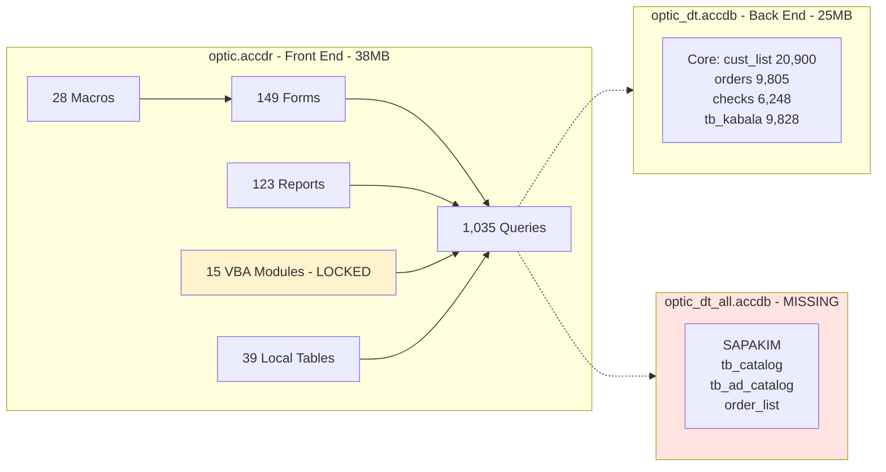
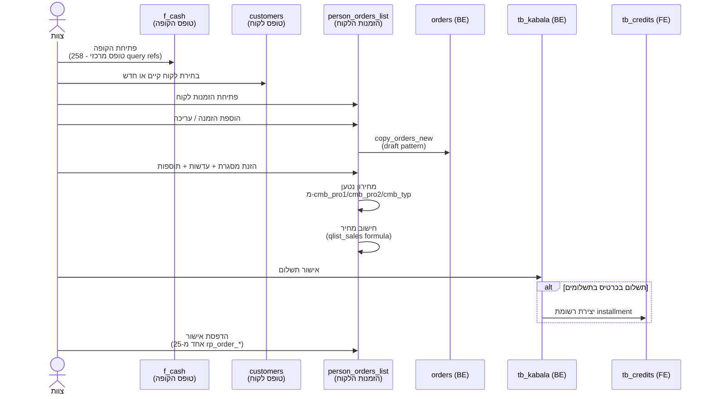
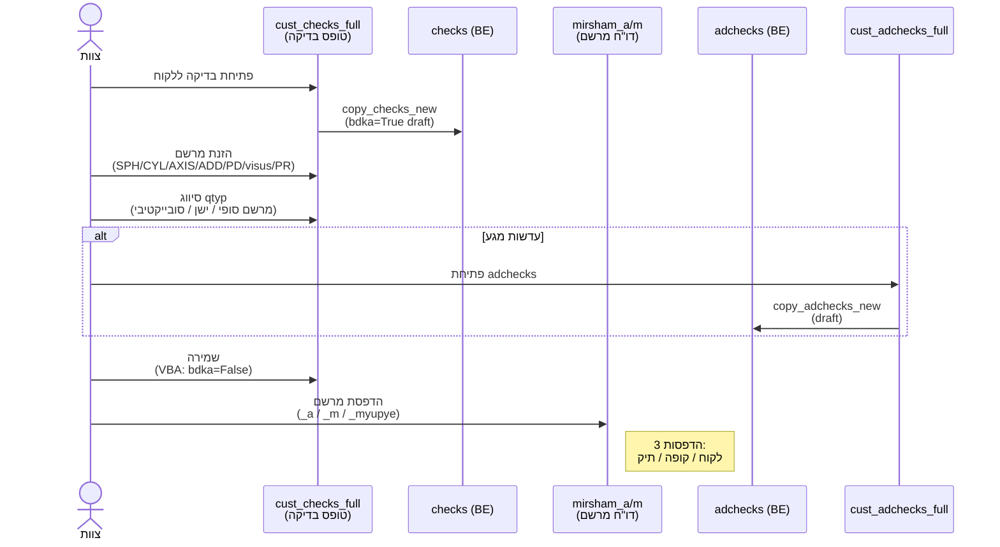
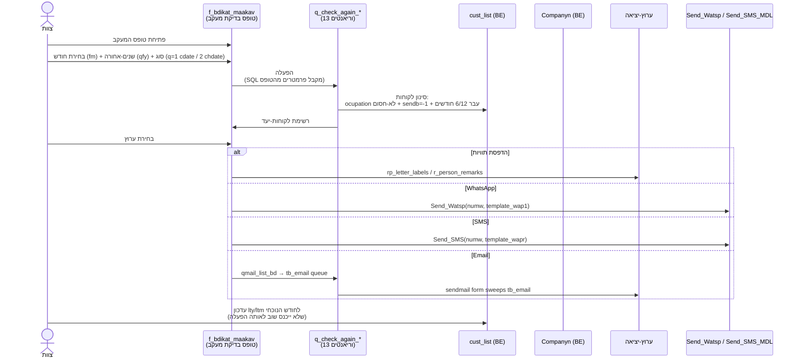
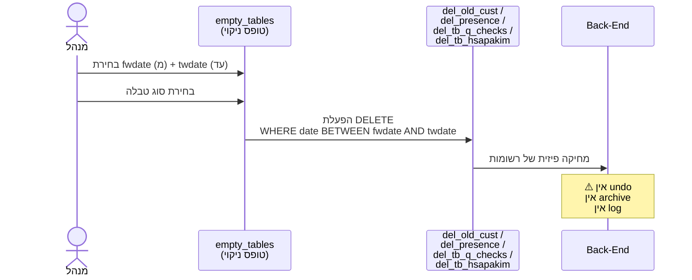
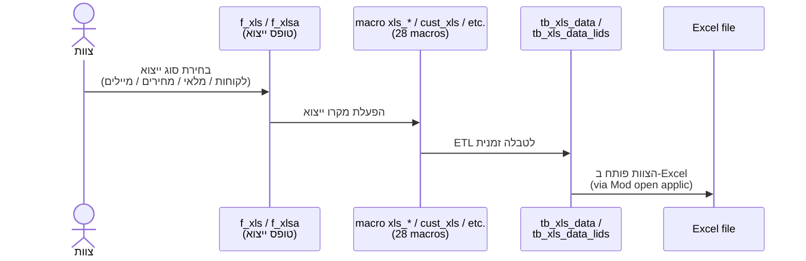

# דו"ח Audit ל-Front-End של Access (משלים לדו"ח ה-Back-End)

**קובץ נסקר:** `tests/optic.accdr` (38 MB)
**מצב חקירה:** Read-only. עותק זמני נוצר ל-`_data_fe/optic_temp.accdb` כדי לאפשר Access.Application; הקובץ המקורי לא נוגע.
**תאריך הדו"ח:** 2026-05-06
**מטרה:** השלמת ה-audit של ה-back-end (`optic_dt.accdb`) — ללכוד את ה-workflows, הלוגיקה העסקית והאינטגרציות שחיים בקובץ הקדמי, לקראת תכנית cutover ל-OpticUp.

---

## 1. תקציר מנהלים

הקובץ פתוח לחלוטין: **149 טפסים, 123 דוחות, 1,035 queries, 15 מודולי VBA, 28 מקרואים**. הליבה התפעולית מתבררת בבירור:

1. **המוצר נקרא "OpticPlus"** (מסיק מ-`C:\OpticPlus_Data\` ב-Connect strings) — תוכנת Access מסחרית שפריזמה רכשה. **לא נבנה in-house**. זה הופך את ה-cutover למשמעותי במיוחד: אנחנו לא מחליפים סקריפט פנימי אלא **מוצר תעשייתי שלם** עם קוד-VBA נעול.
2. **קיים back-end שני שלא ידענו עליו: `optic_dt_all.accdb`** — מאחסן את טבלאות הספקים האמיתיות (`SAPAKIM`), קטלוג מסגרות (`tb_catalog`), קטלוג עדשות-מגע (`tb_ad_catalog`). 7 מ-38 הטבלאות הקשורות מצביעות אליו. **אין לנו את הקובץ הזה. צריך לבקש אותו** לפני שמתכננים מודול ספקים/קטלוג.
3. **VBA נעול בסיסמה** (Protection=1). אנחנו רואים שמות מודולים אבל לא קוד-מקור. **9 מהמודולים הם ספריות utility** (calendar widget, label saver, gradient, shrinker — קוד open-source מוטמע). **6 הם custom**: `Send_SMS_MDL`, `Send_Watsp`, `Mod open applic`, `mymod`/`mymod1`/`mymod2`, `s_lang`, `scan`. הלוגיקה העסקית הקריטית — חישוב מחיר, ביצוע sequential numbers, ביצוע התקנת WhatsApp/SMS — חסומה. **אבל הרבה ממנה מתגלה ב-1,035 ה-queries**.

---

## 2. מתודולוגיה והגבלות

### גישות שעבדו
- **DAO 12.0 COM (32-bit):** סיפק את כל ה-TableDefs (92), QueryDefs (1,035 — כולל SQL מלא), Containers (Forms, Reports, Modules, Scripts), Relations.
- **Access.Application COM:** סיפק את שמות הטפסים/דוחות/מודולים/מקרואים. הרצה ארכה ~30 שניות (תלוי במציאת ה-back-ends במיקום הקבוע).

### גישות שלא עבדו
- **VBA Source extraction (CodeModule.Lines):** נחסם — `VBProject.Protection=1` (locked לצפייה). הסיסמה לא ידועה. **אנחנו רואים שמות מודולים בלבד**, לא קוד.
- **Per-Form RecordSource API:** נחסם — `AccessObject.Properties` לא חושף את `RecordSource` בלי לפתוח את הטופס בעיצוב. פתיחת טופס הייתה דורשת mutation ולכן נמנע.
- **AutoExec macro inspection:** לא נסקר — היה מצריך הרצה.

### דרישות תפעוליות שגילינו תוך כדי
- ה-front-end דורש את ה-back-ends במיקום הספציפי `C:\OpticPlus_Data\` (קישורים hardcoded). נאלצנו ליצור עותקים זמניים שם כדי ש-Access יוכל לפתוח. הוא **לא הצליח להיפתח** עד שגם `optic_dt_all.accdb` היה במיקום (גם אם זה רק placeholder).

### פרטיות
- **לא נכללים בדו"ח:** שמות לקוחות, טלפונים, אימיילים, ת"ז, ערכי מרשם, תוכן free-text של הערות.
- **כן נכללים:** שמות forms/reports/queries/modules/macros, RecordSources/SQL מלא של queries, שמות שדות, פרמטרים מצרפיים, פורמולות תמחור.

---

## 3. ארכיטקטורת ה-Front-End / Back-End

### ההפרדה
ארכיטקטורת Access קלאסית של **Front-End / Back-End split**:
- `optic.accdr` (38 MB) — Front-End: UI, לוגיקה, queries, דוחות.
- `optic_dt.accdb` (25 MB) — Back-End ראשי: טבלאות הליבה (לקוחות, הזמנות, בדיקות, קבלות).
- `optic_dt_all.accdb` (גודל לא ידוע) — Back-End שני: ספקים וקטלוגים (אין לנו את הקובץ).



### ה-Back-End הנוסף (`optic_dt_all.accdb`)
7 מהטבלאות המקושרות מצביעות אליו:
- `SAPAKIM` — **רשימת ספקי-מעבדה האמיתית** (שדות: `SHEM SAPAK`, `CODE SAPAK`, `EMAIL`, וכנראה גם טלפון, כתובת ועוד)
- `tb_catalog` — קטלוג מסגרות (שדות: `incode`, `hevra`, `degem`, `godel`, `color`, `cprice`, `amount`, `sapak`)
- `tb_ad_catalog` — קטלוג עדשות-מגע
- `order_list` — רשימת הזמנות (כנראה view או archive)
- `tb_upd_amount` / `tb_upd_amount_ad` — עדכוני כמויות
- `TT TELEFONE SAPAKIM` — טלפוני ספקים

**משמעות אסטרטגית:** ה-audit הקודם של ה-back-end **חסר את כל מערך הספקים והקטלוג**. מודול ה-Inventory ב-OpticUp (Module 1) קיים אבל ייתכן שהוא לא יודע על המיפוי המלא של קודי SAPAK → שמות ספקים. **לפני שממשיכים, חייבים לבקש את הקובץ `optic_dt_all.accdb` ולעשות גם לו audit**.

### טבלאות מקומיות ב-Front-End (39)
חלקן working/temp tables, אבל כמה מהן **מכילות נתונים פעילים שלא בכל back-end**:

| טבלה | רשומות | תפקיד מנוחש |
|---|---:|---|
| **`tb_credits`** | **1,160** | תוכניות תשלומים בכרטיס אשראי — תשלומים ב-N תשלומים. **נתונים אמיתיים, לא בstaging.** |
| `tb_yoman` | 49 | תבנית ה-grid של תצוגת היומן (config UI), לא נתוני תורים |
| `tb_sum_lekohot` | 12 | סיכום-לקוחות לחישוב LTV |
| `tb_ltv` / `tb_ltv_return` | 12 / 12 | חישובי LTV (lifetime value) |
| `tb_lekohot` | 12 | סיווג לקוחות (12 קבוצות) |
| `tb_parts` / `tb_parts_ordr` | 18 / 10 | לוקאפ של חלקי מסגרת (מוט, פרונט, גשר, אפונים…) |
| `tb_lens` | 8 | סוגי עדשות |
| `tb_frame` | 4 | סוגי מסגרת |
| `tb_mirsham` | 7 | קודי מרשם |
| `tb_misgarot` / `tb_misgeret` | 1 / 3 | מסגרות (lookup) |
| `tb_adashot` | 1 | סוגי עדשות (lookup) |
| `tb_graf_main` / `tb_grafb` / `tb_grafr` | 37 / 11 / 11 | נתוני גרפים (כנראה דשבורד) |
| `Attendance_type` | 4 | סוגי נוכחות נוספים מעל `presence_type` ב-back-end (4 vs 7) |
| `parameters` / `tmp_parameters` / `path` | 1 / 1 / 1 | הגדרות מערכת + נתיבי קבצים |
| `monthn` / `hebday` / `hebwday` / `hebwmonthtbl` / `year_list` | 12 / 7 / 30 / 14 / 46 | לוקאפים של תאריכים בעברית |
| `qpid` / `tb_lastfolder` | 1 / 1 | bookmarks/state UI |
| `csv_table` / `letter_labels` / `presence_wrk_tbl` / `sel_list` / `tb_email` / `tb_xls_data` / `tb_xls_data_lids` / `tb_labels` / `tb_qnum` / `tb_qnum_un` / `tb_q_credits` | 0 | טבלאות עבודה זמניות (staging) |

**הנתונים המהותיים שחיים רק ב-front-end:** `tb_credits` (1,160 רשומות של תכניות תשלומים) — אם נשכח את הקובץ הזה, **נאבד את כל מעקב ההלוואות/תשלומים בכרטיס אשראי**.

---

## 4. פילוח ה-Forms (149 טפסים)

הניתוח על-פי שמות + הצלבה לכמה queries מתייחסים לכל טופס.

### Forms המרכזיים (לפי כמות אזכורים ב-queries)

| טופס | אזכורים ב-queries | תפקיד |
|---|---:|---|
| **`f_cash`** | **258** | **טופס הקופה הראשי**. הליבה התפעולית — היכן שהצוות עושה רוב היום-יום (קבלות, תשלומים, עזרים). |
| `person_orders_list` | 109 | רשימת הזמנות ללקוח — דרך הניווט "פתיחת לקוח → הזמנה" |
| `s_mehirot` | 94 | תת-טופס מחירים — נטען בכל מקום שצריך לחפש מחיר |
| `birthdaysheb` | 64 | רשימת ימי-הולדת בעברית (לדיוור) |
| `s_melai` | 47 | תת-טופס מלאי |
| `f_ad_catalog` | 41 | קטלוג עדשות-מגע |
| `birthdays` | 40 | רשימת ימי-הולדת (גנרי) |
| `customers` | 35 | טופס הלקוח הראשי |
| `cust_listb` | 24 | רשימת לקוחות B (ה-156 שראינו ב-back-end) |
| `f_catalog` | 22 | קטלוג מסגרות |
| `Calendar_of_Attendance` | 21 | יומן נוכחות |
| `s_orders` | 19 | תת-טופס הזמנות |
| **`f_bdikat_maakav`** | **19** | **טופס "בדיקת מעקב"** — מנהל את כל מערך ההזכרות לחזרה לבדיקות |
| `print_cust` | 12 | הדפסת לקוח |
| `find_order` | 12 | חיפוש הזמנה |

### חלוקה לקבוצות פונקציונליות

#### לקוחות וניהול (~16 טפסים)
`customers`, `customers_new`, `customers_lids` (lids = leads), `cust_list`, `cust_listb`, `cust_listw`, `cust_file_list`, `f_short_cust_list`, `print_cust`, `cust_checks_full`, `cust_checks_full_w`, `cust_adchecks_full`, `cust_adchecks_full_w`, `f_join_cards` (מיזוג כרטיסי לקוח), `s_adap`.

#### בדיקות עיניים ומרשמים (~6 טפסים)
`f_mirsham` (מרשם), `f_q_checks` (queue), `f_mem_checks` (הערות), `f_gnrl_tests` / `f_gnrl_testsa` (בדיקות כלליות — לטבלה הריקה ב-back-end), `s_checks`.

#### עדשות-מגע ומסגרות (~4 טפסים)
`f_ad_catalog`, `f_ad_tests`, `f_adashot`, `f_adashotq`, `f_misgarotq`.

#### הזמנות וקופה (~10 טפסים)
`order_frm_f`, `order_frm_s`, `order_list_all`, `s_orders`, `s_orders_daily`, `person_orders_list`, `orders_remarks_list`, `f_kabala` (קבלות), `s_takbul` / `s_takbul_daily`, `f_cash`.

#### תקשורת WhatsApp/SMS/Mail (**~30 טפסים — שליש מהמערכת!**)
`f_mail_detail`, `f_sms_detail`, `f_waps_detail`, `f_wats_msg`, `f_wats_msgab`, `f_wats_msgb`, `f_wats_msgmy`, `frm_wats_1` עד `frm_wats_4`, `frm_wats_ab`, `frm_wats_my`, `frm_watsk_1`, `frm_watsma_1`, `frm_watsmb_2`, `frm_watsmb_3`, `frm_watsmmf_1`, `frm_watsmmfr_1`, `frm_watsmms_1`, `frm_watsmmsr_1`, `frm_watsr_1` עד `frm_watsr_4`, `frm_watsr_ab`, `frm_watsr_my`, `frm_watsrk_1`, `frm_watsrma_1`, `frm_watsrmb_2`, `frm_watsrmb_3`, `sendmail`, `msgform`.

זה מספר **חריג** של טפסי-תקשורת. כל סוג הודעה (אישור, מבצע, חזרה לבדיקה, ימי-הולדת, תיקון מוכן, מסירה, החזרה) מקבל טופס נפרד. **המשמעות:** ה-WhatsApp/SMS הוא הליבה האמיתית של פריזמה, לא תוספת.

#### יומן ונוכחות (~8 טפסים)
`Calendar_of_Attendance`, `clock_form`, `date_list`, `date_reminder`, `f_yoman`, `frmCalendar`, `find_clndr`, `ptb_yoman`.

#### ימי-הולדת (~3)
`birthdays`, `frm_birth`, `frm_birthh`.

#### קטלוג ומלאי (~10)
`f_catalog`, `f_sub_catalog`, `f_sub_catalog_ad`, `f_adds_catalog`, `f_adds_desc`, `f_adds_typ`, `f_misgarotq`, `f_barcode_wrk`, `find_catg`, `find_a_catg`, `s_melai`, `s_melai_prt`, `s_mehirot`.

#### ספקים ומעבדה (~4)
`CARTIS SAPAK` (כרטיס ספק), `f_hesh_sapakim`, `s_sum_sapakim`, `TT TELEFONE SAPAK`.

#### תצורה (~12)
`f_company`, `f_options`, `f_gen_parms`, `f_bank_list`, `f_credit_list`, `f_kupa`, `f_haver` (חבר), `f_meda`, `f_mkor`, `f_sivug`, `f_reduce`, `f_kamp`.

#### אבטחה (~3)
`newpass`, `newpassm`, `start_form`, `s_reg_key` (מפתח רישום של המוצר!).

#### Maintenance / Admin (~6)
`empty_tables` (**מסוכן** — מוחק נתונים בטווח תאריכים), `f_q_pay_presence`, `f_upd_presence`, `s_log`, `outfiles`, `scan_file`.

#### אחר (~10)
`about`, `f_zimunim`, `f_h_vs_h`, `f_qmaga`, `f_total_doc_hours` / `..._p`, `find_che`, `find_cust`, `find_hesh`, `frm_maakav`, `frm_teur`, `f_bituaj` (ביטוח), `f_bodek` (בודק), `f_quest` (שאלון), `f_xls`/`f_xlsa` (ייצוא Excel), `s_expns` (הוצאות), `s_log`, `s_total_sales`, `title_form`, `ftrial`.

---

## 5. פילוח ה-Reports (123 דוחות)

הצוות **מדפיס הרבה**. להלן הפילוח:

### דוחות הזמנה (~25 גרסאות!)
זה החלק הכי מדהים. **25 גרסאות שונות של "הדפסת הזמנה"**:
- `rp_order` — בסיסי
- `rp_order_a` / `rp_order_a_env` / `rp_order_a_env_t` — גרסת a + מעטפה (label)
- `rp_order_achk` — a + check
- `rp_order_ada` / `rp_order_adb` — a/b
- `rp_order_env` / `rp_order_env_t` — מעטפה
- `rp_order_frm` — form
- `rp_order_keep` — לשמירה
- `rp_order_lab_check` — בדיקת מעבדה
- `rp_order_m` / `rp_order_mp` / `rp_order_mp_all` / `rp_order_mpchk` — variants m
- `rp_order_msgra` / `rp_order_msgrb` — message a/b
- `rp_order_prop` — proposal
- `rp_order_repaira` / `rp_order_repairb` — תיקון
- `rp_order_spka` / `rp_order_spka_ad` / `rp_order_spkm` — supplier (לשליחה ל-`rp_sapak`)
- `rp_order_task` — משימה

**משמעות workflow:** עבור כל הזמנה הצוות בוחר באיזה דוח להדפיס לפי הקונטקסט (לקוח / מעבדה / ספק / תיקון / מסירה / משימה). **עומק העבודה הניירתית כאן עצום**. ב-OpticUp נחליף עם document templates נחותים יותר אבל גמישים יותר.

### דוחות מרשם (~7)
`mirsham_a` / `mirsham_a_old` / `mirsham_a_old_all` (עדשות-מגע — `_a`)  
`mirsham_m` / `mirsham_m_old` / `mirsham_m_old_all` (משקפיים — `_m`)  
`mirsham_myupye` (= "מרשם מיופה" — מרשם עם חתימה דיגיטלית/חותמת לבית-הולים).

### דוחות פיננסיים — מיוחד ל-LTV (~6)
- `rp_lekohot_gnrl_ltv` — LTV כללי
- `rp_lekohot_multi_ltv` — LTV מולטיפוקל
- `rp_ltv_gnrl` / `rp_ltv_multi` — LTV שניהם
- `rp_ltvret_gnrl` / `rp_ltvret_multi` — LTV "return" (כנראה לקוחות חוזרים)

**זה כלי-CRM מתקדם** — חישוב lifetime value לכל לקוח, פילוח לפי "בעל מרשם רגיל" vs "בעל מרשם מולטיפוקל". **OpticUp צריך מודול-Reports שמספק את אותם החתכים** — כך פריזמה תזהה לקוחות בעלי-ערך ויידע איך להחזיר אותם.

### דוחות מכירות (~6)
`r_total_sales` / `r_total_sales_p`, `r_total_orders`, `rplist_sales` / `rplist_sales_sum`, `rplist_orders` (× 3 variants).

### דוחות חודשיים (~3)
`rp_total_month_detail` / `_p`, `rp_total_month_sum` — דוחות סיכום חודשיים (כנראה לרואה-חשבון).

### חשבוניות / קבלות / תשלומים (~10)
`rp_takbul` (× 5 variants — ינ' / ק / t / t_d) — קבלות.  
`rp_inpiraon` — קבלות לפי תאריך פירעון (לצ'קים פוסט-דייטד).  
`rp_hesh` / `rp_heshboniyot` — חשבוניות.  
`rp_hafkada` — דוח הפקדה (לעמלות בנק).  
`yitra_doc` — יתרה (debt/credit balance per customer).

### דוחות מלאי ומחירים (~12)
`rp_melai_*` (5 variants), `rp_mehirot_*` (12 variants — כולל בודק חוסרים, "not selling", "over-stock", barcode errors).

### דוחות ספקים (~5)
`rp_sapak` — דוח ספק יחיד.  
`rp_sum_sapakim` / `_all` / `_all_s` — סיכום ספקים.  
`rp_tel_sapakim` — רשימת טלפוני-ספקים.

### דוחות-לקוח ועזר (~10)
`birth_doc` / `birth_doch` — מכתב יום-הולדת.  
`cust_list_doc` / `_area` — רשימת לקוחות.  
`person_list_labels`, `r_letter_labels` / `_33` — תוויות.  
`rp_clndr` / `_day` / `_find` / `_yoman` — יומן.  
`r_person_remarks`, `rp_log_doc`.

### Utilities (~6)
`ReportToPdf`, `cartis_blank`, `insw_doc`, `inv_doc`, `kishrey_hutz` (קשרי חוץ), `rp_title`, `rp_xls` / `rp_xlsa`, `rp_qmaga`, `rp_repair`, `rpl_order`, `rplist_checks`, `rp_quest`, `rp_ad_tests`, `rp_check`, `rp_ashrai`, `rp_ins`, `rp_stg_doc` / `rp_stgm_doc`.

---

## 6. ה-1,035 Queries: הלוגיקה העסקית הקבורה

**זה החלק החזק ביותר של החקירה.** ה-queries הם המקום שבו לוגיקת העסק מקודדת — ולכל אחד יש את ה-SQL המלא.

### פילוח לפי סוג

| סוג DAO | קוד Type | כמות | פירוש |
|---|---|---:|---|
| SELECT | 0 | 856 | שאילתות קריאה |
| DELETE | 32 | 27 | מחיקות נתונים |
| UPDATE | 48 | 33 | עדכוני נתונים |
| APPEND (INSERT) | 64 | 28 | הוספות נתונים |
| UNION (set op) | 128 | 91 | איחודים |

סך הפעולות שמשנות נתונים: **~88 queries** (DELETE + UPDATE + INSERT). הן מודלים את כל הזרמים שהמערכת מבצעת אוטומטית.

### פילוח לפי מורכבות

- **No JOIN:** 809 (78%) — שאילתות פשוטות
- **Single JOIN:** 126 (12%) — קישורי-יחיד
- **Multi-JOIN (≥2):** 100 (10%) — **לוגיקה עסקית אמיתית**

מתוך 100 ה-multi-JOIN, רק 99 הן manual (לא `~sq_*` אוטו-יצורות מטפסים) — אלו הן ה-queries שאדם כתב במכוון, כל אחת מהן הוא תהליך עסקי מקודד.

### פילוח לפי מילה-מפתח

| מילה | queries מתייחסים | משמעות |
|---|---:|---|
| `IIF` | 242 | conditionals — ה-`CASE WHEN`-לוגיקה כל מקום |
| `Forms!` | 210 | queries שקוראות פרמטר מ-טופס פתוח. **210 = יותר מ-20% מה-queries — UI-driven SQL** |
| `catalog` | 160 | קטלוג |
| `YEAR(` | 82 | חתכים שנתיים |
| `SAPAKIM` | 66 | ספקים |
| `kupa` | 43 | קופת חולים |
| `moadon` | 37 | מועדון |
| `DATEDIFF` | 28 | חישובי הפרשי תאריכים |
| `sapakm` | 26 | קוד-ספק בהזמנה |

### דפוסי שמות

| prefix | כמות | משמעות |
|---|---:|---|
| `~sq_*` | 320 | אוטומטיים (מ-RecordSource של טפסים/דוחות) |
| `q_*` (לא ~) | 157 | manual לוגיקה עסקית |
| `qlist_*` | 148 | רשימות (RecordSource של list views) |
| `del_*` | 34 | מחיקות (כולל wipe-table-by-date) |
| `qp_*` | 29 | print queries |
| `qtb_*` | 24 | table queries |
| `cmb_*` / `combo_*` | 21 + 8 = 29 | combo box dropdowns (lookup) |
| `tb_*` | 20 | table operations |
| `ctlg*` | 16 + 8 + 4×3 = 40 | catalog queries (× variants) |
| `upd_*` | 11 | updates |
| `qprt_*` / `prt_*` | 10 + 8 = 18 | print queries |
| `qmail_*` | 7 | תכניות דוא"ל |
| `qcust_*` / `cust_*` | 5 + 5 = 10 | customer queries |
| `qrp_*` | 5 | report queries |

### דוגמאות חזקות

#### 6.1 הפורמולה לחישוב מחיר סופי (`qlist_sales`)

ה-query הארוך ביותר (7,090 תווים) מכיל את הליבת התמחור:

```
round(IIf(Val(nz([gdisc])) > 0,
  (Format([bprice]*((Val(Nz([qmaam]))/100)+1),"0.00")) - (Val(nz([gdisc])) * (Format([bprice]*((Val(Nz([qmaam]))/100)+1),"0.00"))) / 100,
  (Format([bprice]*((Val(Nz([qmaam]))/100)+1),"0.00")) - (Val(Format(Val(nz([greduce]))/Val(nz([gprice])),"0.000")) * (Format([bprice]*((Val(Nz([qmaam]))/100)+1),"0.00")))
)) AS tot
```

במילים:
1. **בסיס:** `bprice × (1 + qmaam/100)` — מחיר מסגרת × (1 + מע"מ).
2. **הנחה:** אם `gdisc > 0` (יש אחוז הנחה גלובלי), מחסירים `bprice × (1+מע"מ) × gdisc/100`.
3. **אחרת:** מחסירים את **היחס היחסי של ההנחה על העדשות** (`greduce / gprice`) שמוחל גם על המסגרת.

זה אומר: **כשמכניסים הנחה על עדשות, המסגרת מקבלת את אותה הנחה יחסית**. דבר חכם תפעולית ("הנחת חבילה") — אבל לא טריוויאלי.

**ב-OpticUp:** זה צריך להיות פונקציה אטומית `calculate_order_price(...)` עם הזה כפסאודו-קוד מתועד. אחרת הצוות לא יבין מה השתנה אחרי ה-cutover.

#### 6.2 מנגנון ההזכרה לבדיקת ראייה חוזרת — 13 וריאציות (`q_check_again_*`)

13 גרסאות של אותה לוגיקה: **עבר חצי שנה (אם `swb=True`) או שנה (אחרת) מאז `cdate` או `chdate` (האחרון שבהם), והיום אנחנו בחודש הנכון לפי `Forms!f_bdikat_maakav!fm`?**

ה-13 וריאנטים:
- `q_check_again` — הליבה
- `_frm` / `_frms` / `_frmsa` / `_frmsm` — ל-form (לרשימה ב-UI)
- `_L` — ל-Labels (תוויות הדפסה)
- `_old` — גרסה ישנה
- `_rv` / `_rva` / `_rvm` — review variants
- `_u` / `_ua` / `_um` — Update variants

**זוהי מערכת ה-recall של פריזמה**:
- מטריצה של פילטרים: כל לקוח עם `ocupation` לא-חסום, `sendb=-1` (מנוי לדיוור), שעבר זמן מאז הבדיקה האחרונה.
- חודש נוכחי הוא חודש-ה-recall של הלקוח (לפי `lty/ltm` שכבר התווסף).
- התוצאה: רשימת לקוחות לחזור אליהם → דוח להדפסה / WhatsApp / SMS / Email.

**אם פריזמה תאבד את הלוגיקה הזו ב-cutover — היא תפסיד את המנוע שמחזיר לקוחות.** זה הקשר ישיר להכנסה.

**ב-OpticUp Module 4 (CRM):** ה-cadence engine שכבר נבנה (לאירועי SuperSale וכד') צריך להתרחב לכלול recall-by-vision-check.

#### 6.3 שליחת הודעות — `qmail_list_bd`, `qmail_list_insw`, `qmail_list_inv`

INSERT INTO `tb_email` של אימיילים נמענים, על-פי תנאים שונים:

- **`qmail_list_bd`** — bdika (בדיקה): לקוחות שעבר זמן מהבדיקה האחרונה, עם email, מנוי לדיוור.
- **`qmail_list_insw`** — insurance window (חלון של חודש לפני ועד שבועיים אחרי `cleandate`).
- **`qmail_list_inv`** — invoice/inserts (שבוע אחרי `insdate`, עם `swd=False`).

3 cadences שונות, 3 אירועי-עסק שונים, כולן באמצעות `tb_email` כתור. **מי בולע את התור?** כנראה VBA — `Send_Watsp` או `Send_SMS_MDL` או ה-`sendmail` form.

#### 6.4 העתקות עריכה — דפוס "draft / commit / cancel"

ה-`copy_*` ו-`del_*` queries חושפים שיטה עקבית:

- **התחלת עריכה:** `copy_checks_new` — מכניס שורת checks חדשה עם `bdka=True` (working draft).  
  או `copy_checks` — משכפל בדיקה קיימת לדראפט.
- **שמירה:** הצוות מעדכן שדות, ובסוף ה-VBA מעדכן `bdka=False` (commit).
- **ביטול:** `copy_checks_del` — מוחק את כל השורות עם `bdka=True` של הלקוח.

**זה מנגנון לעריכה אטומית** — ה-form עורך אובייקט-טיוטה, ובסיום הצוות מחליט "save" או "cancel". ב-OpticUp:  pattern נכון יהיה **draft / publish באמצעות `is_draft` boolean או `pending_*` table**, אבל עם RLS על משתמש המעריץ.

#### 6.5 ניקוי טבלאות לפי טווח תאריכים — `del_old_cust`, `del_presence`, וכו'

הצוות יכול דרך טופס `empty_tables` להזין טווח `fwdate`/`twdate` ולמחוק:
- `cust_list` — לקוחות בטווח
- `presence` — נוכחות בטווח
- `tb_q_checks` — מעקב מעבדה בטווח
- `tb_hsapakim` — חשבוניות ספקים בטווח
- `items_sales` — פריטי-מכירה בטווח

⚠️ **זה הסבר ישיר** למה ראינו ב-back-end נתונים מתחילים רק ב-2021 (כשהטבלאות נוצרו ב-2000): **הצוות מנקה היסטוריה תקופתית**. כך נאבדה ההיסטוריה הישנה. **ב-OpticUp נצטרך מנגנון "soft delete + archive"** ולא delete קשה.

#### 6.6 איחוד תשלומים מתשלומים — `q_tashlumim` / `q_tashlumim_xls`

UNION של:
- `tb_credits` (תשלומים מקומיים בכרטיס) — צוות מנהל ידנית
- `tb_kabala` ב-back-end (קבלות שאינן באשראי)

זה מערך **כפול** של מנגנון תשלומים. `tb_credits` (1,160 רשומות) ב-front-end, `tb_kabala` (9,828) ב-back-end — בשני מקומות.

**משמעות ל-cutover:** מודול תשלומים ב-OpticUp (M7) חייב לאחד את שניהם ל-טבלה אחת.

---

## 7. VBA Modules — מה אנחנו יודעים

ה-VBA נעול בסיסמה (Protection=1). אנחנו רואים שמות מודולים בלבד. להלן הניחוש המבוסס על השם:

### ספריות utility (open-source / OEM)
| מודול | תפקיד |
|---|---|
| `ajbCalendar` | widget של calendar (open-source — Andrew Bibulous?) |
| `basFolderBrowse` | דיאלוג-בחירת-תיקייה (פותח בקבצי PDF/Excel) |
| `basFormBackColorGradient` | צביעת רקע טופס בגרדיאנט (UI cosmetic) |
| `basLabelSaver` | שומר labels |
| `basShrinkerStretcher` | שינוי-גודל אוטומטי של טפסים — לרזולוציות שונות |
| `clsSinkSSFormEvents` | עוזר ל-ShrinkerStretcher |
| `GetSerial` | מחזיר serial-number (DRM/registration?) |

7 מתוך 15 הם utilities. **לא חשובים ל-cutover**.

### Custom business modules (8)
| מודול | מה זה עושה (מנוחש) |
|---|---|
| **`Send_SMS_MDL`** | **שליחת SMS** — מודול האינטגרציה עם gateway (כמו Twilio ישראלי, או Kavkom, או 019 SMS Service) |
| **`Send_Watsp`** | **שליחת WhatsApp** — אינטגרציה עם WhatsApp Web/Business API |
| `Mod open applic` | פתיחת קבצים חיצוניים (Word/Excel/PDF). עוזר להצגת דוחות. |
| `mymod` / `mymod1` / `mymod2` | **3 מודולים custom** — ככל הנראה הליבה העסקית: חישובי מחיר, sequence-numbering, ולידציות, אירועי-טפסים. **כאן מסתתרת רוב הלוגיקה**. |
| `s_lang` | מודול תרגומים — Hebrew/English/Russian/Spanish (מהדאמפ ב-back-end ראינו שיש שפה לכל הזמנה) |
| `scan` | סריקה — חיבור לסורקי מסמכים (כתיבה: ID/חתימה דיגיטלית?) |

### מסקנה לגבי VBA
**הקוד נעול אבל המבנה ברור.** הליבה העסקית (חישובי מחיר, sequential numbering לקבלות/הזמנות, validation) חיה ב-`mymod` × 3. הצוות שמתכנן את ה-OpticUp צריך לפגוש מישהו שיודע לפתוח את הסיסמה (מי שהתקין את המוצר, או הספק המקורי) — אחרת **חלק מהלוגיקה לא מתועד שם**.

**מסלול חלופי:** לחקור את התופעות היוצאות (output) — ה-queries מספקות הרבה. לדוגמה, פורמולת התמחור גלויה ב-`qlist_sales`. מנגנון ה-recall גלוי ב-13 ה-`q_check_again_*`. מנגנון העריכה גלוי ב-`copy_*`/`del_*`. **VBA הוא "glue code"** שקושר טפסים לפעולות — והרבה מהפעולות הן queries.

---

## 8. Macros (28 — בעיקר Excel exports)

**14 מ-28 המקרואים הם ייצואי Excel** (`xls`, `xls_*`, `mehirot_xls`, `melai_xls`, `cust_xls`, `mail_xls`, `sel_xls`, `cataloga_xls`, `catalog_xls`, `mehirotad_xls`, `melai_g_xls(G)`, `melai_xlsG`, `xls_ap`, `xls_bill`, `xls_h`, `xls_hold`, `xls_p`, `xls_t`).

**משמעות:** **Excel היא ה-deliverable העיקרי** של הצוות לפעולות שאינן הדפסה ישירה. כל דוח (לקוחות / מחירים / מלאי / קטלוג / מיילים) ניתן לייצוא ל-Excel. **OpticUp צריך ייצוא Excel נורמטיבי בכל הדוחות** — אחרת הצוות יחווה נסיגה.

האחרים: `barweb` (ברקוד-web?), `closereport`, `find_field`, `open_doc`, `open_tb_*` (3), `print_rep`, `quit_mdb`, `setuppr` (setup printer).

---

## 9. אינטגרציות חיצוניות שזוהו

### מאומתות
| אינטגרציה | היכן | הוכחה |
|---|---|---|
| **WhatsApp** | מודול VBA `Send_Watsp` + 25 טפסי WhatsApp + תבניות `doc_title.wap*` | שם המודול + כמות טפסים חריגה |
| **SMS** | מודול VBA `Send_SMS_MDL` + טופס `f_sms_detail` | שם המודול |
| **Email** | טופס `f_mail_detail`, `sendmail`, queries `qmail_*`, טבלת תור `tb_email` | מנגנון תור-מיילים מלא |
| **Excel export** | 14 מקרואים `xls*` + טבלאות staging `tb_xls_data` / `tb_xls_data_lids` | המוני נקודות-יציאה |
| **PDF / Word / external open** | מודול `Mod open applic` + דוח `ReportToPdf` | שם המודול + דוח ייעודי |
| **סריקת מסמכים** | מודול `scan` + טופס `scan_file` | שם המודול |
| **ברקוד** | `f_barcode_wrk` (working table) + `barweb` macro + שדה `bar_size` ב-orders | מנגנון ברקוד עצמאי |

### חשודות / לא מוכחות (ללא קוד-VBA לא ניתן לאמת)
- **קופה / POS חיצוני** — `companyn.kupar=true` בתצורה, וקיימים שדות `wsnif` (סניף), `wnumber` (מספר קופה?). יכול להיות שיש שילוב עם מערכת קופה חיצונית, אבל בלי VBA אנו לא יכולים לוודא.
- **סליקת אשראי אונליין** — מנגנון tashlumim עובד פנימית, אבל ייתכן שהצוות מעביר נתונים ל-מערכת סליקה חיצונית (Cardcom / Tranzila וכד'). אינדיקטור: שדות `wnumber` / `whashbon` / `nt` (מספר תשלומים) ב-`tb_kabala` — נראה כמו אינטגרציה, לא רק תיעוד ידני.
- **DRM / רישוי** — מודול `GetSerial` + טופס `s_reg_key` מעידים על מנגנון רישוי של המוצר ("OpticPlus"). **נדרש לוודא שיש לפריזמה רישיון בתוקף**, אחרת המעבר ל-OpticUp הוא הזדמנות לא לשלם תוספת.

### לא נמצאו (אבל נוכחות אפשרית בקוד-VBA הנעול)
- אינטגרציה לרואה-חשבון (אבל יש המון `xls` exports, אז כנראה ייצואים ידניים)
- API לפיענוח-תרגומים (אבל יש מודול `s_lang`)
- אינטגרציה לכרטיס מגנטי / מועדון פיזי

---

## 10. Workflows הראשיים — מפת ה-3 הזרמים החזקים

### Workflow 1: יום העבודה הסטנדרטי בקופה



### Workflow 2: בדיקת ראייה (חדשה או חזרה)



### Workflow 3: מנוע ה-Recall (החזרת לקוחות לבדיקה)



### Workflow 4: ארגון ומחיקת היסטוריה (תקופתית)



### Workflow 5: ייצוא Excel



---

## 11. תובנות חזקות (משלימות לדו"ח ה-back-end)

### 11.1 המוצר נקרא "OpticPlus" — לא in-house
פריזמה לא בנתה את הקובץ הזה. זה **מוצר Access מסחרי** שקנו ממישהו (כנראה ספק ישראלי). העדויות:
- נתיב Connect קבוע: `C:\OpticPlus_Data\`
- מודולי-VBA ספציפיים: `Send_SMS_MDL`, `Send_Watsp` (סטנדרטיים בענף)
- מודול `GetSerial` + טופס `s_reg_key` = רישוי DRM
- VBA נעול בסיסמה (Protection=1) — הספק לא רוצה שמסתכלים בקוד

**משמעויות אסטרטגיות:**
- אם המוצר נמצא ברישיון פעיל — **OpticUp תאפשר חיסכון בעלות-רישיון שנתית**.
- אם הספק יצא מהשוק — **OpticUp הוא יציאה מתלות מסוכנת**.
- ייתכן שיש לקוחות אחרים של OpticPlus שיהיו לקוחות פוטנציאליים ל-OpticUp SaaS.

### 11.2 קיים back-end שני שלא ידענו עליו — `optic_dt_all.accdb`
**זה הממצא הכי חשוב מהדו"ח הזה.** 7 טבלאות: SAPAKIM (ספקים), tb_catalog (מסגרות), tb_ad_catalog (עדשות-מגע), order_list, tb_upd_amount/_ad, "TT TELEFONE SAPAKIM".

**ה-audit הקודם של ה-back-end היה חלקי**. Module 1 (Inventory) ב-OpticUp כנראה כבר מטפל בקטלוג, אבל **בלי הקובץ הזה אנחנו לא יודעים** את המיפוי בין הקודים הנומריים (sapakm "20", "105"…) לשמות (Hoya/Essilor/Zeiss…).

**פעולה דחופה:** לבקש מ-Daniel את `optic_dt_all.accdb` ולעשות לו audit סוג B (כמו ל-`optic_dt.accdb`).

### 11.3 VBA לוקאל = הליבה העסקית, אבל היא נעולה
3 מודולים בשם `mymod`/`mymod1`/`mymod2` הם המקום שבו הליבה. בלי הסיסמה, אנחנו רואים תוצאות (queries, פורמולות, דפוסי data) אבל לא את הקוד. **אם פריזמה לא יודעת את הסיסמה — צריך להגיע לספק המקורי.**

### 11.4 יש 1,160 רשומות נתונים ב-Front-End שלא בכל back-end
`tb_credits` (תכניות תשלומים בכרטיס) חי **רק ב-front-end** עם 1,160 רשומות אמיתיות. אם ה-cutover עבור רק את ה-back-end, **נאבד מעקב על תשלומים בכרטיס בתשלומים**. 

**פעולה ל-cutover:** סקריפט מיגרציה חייב לחלץ את `tb_credits` מה-front-end ולמזג עם `tb_kabala` ב-back-end ל-`payments` table ב-OpticUp.

### 11.5 WhatsApp הוא ערוץ הליבה, לא תוסף
**~30 טפסים מתוך 149 (20%)** עוסקים ב-WhatsApp. **17 תבניות הודעה בטבלה `doc_title`** (מהדו"ח הקודם). מודול VBA ייעודי `Send_Watsp`. זה לא "feature נחמד" — זה **המקום שבו פריזמה מתקשרת עם הלקוח**. ה-cutover חייב לכלול אינטגרציית WhatsApp פעילה ביום-1.

### 11.6 הצוות מדפיס המון
**123 דוחות + 14 macros ל-Excel = 137 נקודות-יציאה למסמך.** 25 גרסאות של "הזמנה" בלבד. **הצוות חי בעולם נייר**. ב-OpticUp צריך להחליף עם:
- Document templates גמישים שמייצרים PDF
- ייצוא Excel נורמטיבי לכל view
- אבל **לא לפחות מסוגי הדוחות** — אחרת הצוות חווה נסיגה.

### 11.7 סוגי דוחות "מתחבאים" שלא ראינו ב-back-end
- **דוחות LTV** (`rp_ltv_*`, `rp_lekohot_gnrl_ltv` וכו') — חישוב lifetime value שניתן רק כאן. ה-back-end לא מחזיק את החישוב — הוא **נעשה ב-VBA** ומופנה לדוחות. **OpticUp Reports module צריך לקנות את החישוב הזה.**
- **דוחות "מחיר" בודקים** (`rp_mehirot_adp_bar_miss` / `_nsell` / `_over` / `_sel`) — מערך של דוחות בקרת-מלאי עם ברקודים: חסרים, לא נמכרים, עודף, נמכרים. **לוגיקת ניהול-מלאי מתקדמת** שלא בא לידי ביטוי ב-back-end.
- **דוחות סוג "task" / "keep"** (`rp_order_task`, `rp_order_keep`) — workflow תפעולי שלא קוד נוסף.

### 11.8 מנגנון "draft / commit / cancel" — נדרש ל-OpticUp
דפוס ה-`copy_*_new` + `del_*` + העדכון של `bdka=False` ב-VBA הוא **transaction-like** עבור עריכת רשומה — Access לא תומך טבעית בtransactions, אז הם בנו אחד ידנית. ב-OpticUp עם Postgres יש transactions אמיתיות, אבל המבנה המנטלי של "טיוטה לפני שמירה" צריך להישמר.

### 11.9 מסוכן: `empty_tables` יכול למחוק היסטוריה
טופס `empty_tables` עם שדות `fwdate`/`twdate` מאפשר למחיקת:
- לקוחות (cust_list)
- נוכחות (presence)
- מעקב מעבדה (tb_q_checks)
- חשבוניות ספקים (tb_hsapakim)
- מכירות פריטים (items_sales)

⚠️ **אין undo. אין archive. אין log.** זאת **הסיבה הישירה** לכך שהנתונים ב-back-end מתחילים רק ב-2021. **OpticUp חייב למחוק רכה (`is_deleted=true`)** ולא קשה. כבר Iron Rule 3 בפרויקט.

### 11.10 קיים מנגנון רב-שפתי שלא ידוע ב-back-end
מודול VBA `s_lang` + שדה `lang` ב-`orders` (הראשונים שראינו ב-back-end היה: 1,592 עברית / 578 רוסית / 5 אנגלית / 1 ספרדית). זה אומר שכל **הדוחות וההודעות מודפסות בשפה של הלקוח**, לא בעברית-בלבד. **OpticUp צריך i18n מלא ביום-1**, לא רק עברית.

---

## 12. השלמות קריטיות לדו"ח ה-Back-End

ב-Audit הקודם הסקנו שהליבה היא 31 טבלאות. עם נתוני ה-front-end:
- **+1 back-end נוסף:** `optic_dt_all.accdb` עם 7+ טבלאות. סך-הכל ~38 טבלאות data.
- **+1 טבלה אמיתית בfront-end:** `tb_credits` (1,160 רשומות).
- **39 טבלאות עזר ב-front-end:** lookups, working tables, config, staging.

**הסכימה הסופית למיגרציה היא ~78 טבלאות source**, לא 31. הקפיצה הזאת חיונית לתכנון.

### עדכוני מיפוי למודולים ב-OpticUp

המיפוי בדו"ח הקודם נשאר תקף, אבל מתעדכן:

| Source | יעד מודול עדכון |
|---|---|
| `tb_credits` (FE, 1,160) | **M7 (Payments)** — לא M11. זאת תכנית-תשלומים, לא loyalty. |
| `SAPAKIM` (BE2) | **M1 (Inventory) — קיים** או **חדש "Suppliers"**. צריך להחליט. |
| `tb_catalog` (BE2) | **M1** — קטלוג מסגרות. ייתכן שכבר מתועד ב-Module 1. |
| `tb_ad_catalog` (BE2) | **M1** — קטלוג עדשות-מגע. |
| `order_list` (BE2) | **M5 (Orders)** — view של הזמנות. |
| `tb_yoman` (FE config, 49) | **N/A** — תבנית UI. לא להעביר. |
| `tb_credits`, `tb_q_credits` | **M7**. |
| `tb_ltv*`, `tb_sum_lekohot` | **M9 (Reports)** — מטמני LTV. |
| `tb_parts` (FE, 18), `tb_parts_ordr` (FE, 10) | **M5** — חלקי מסגרת. |
| `tb_lens`, `tb_frame`, `tb_misgarot`, `tb_misgeret`, `tb_adashot` (FE) | **M5** — lookup tables. |
| `tb_mirsham` (FE) | **M6 (Prescriptions)** — קודי מרשם. |
| `parameters`, `path`, `tmp_parameters` (FE) | **M2 (Platform Admin)** — tenant config. |
| `monthn`, `hebday`, `hebwday`, `hebwmonthtbl`, `year_list` (FE) | **N/A** — Postgres יודע תאריכים בעברית native. |
| 17 תבניות `doc_title` + 25 טפסי `frm_wats_*` | **M13 (Communications)** — חילוץ + הזרמה. |
| כל ה-25 דוחות `rp_order_*` | **M5 + Document Templates** — צריך טופס-תבניות גמיש. |
| כל ה-`rp_ltv_*`, `rp_lekohot_*ltv` | **M9 (Reports)** — חישוב + הצגה. |
| `Send_Watsp`, `Send_SMS_MDL` (VBA) | **M13 + Edge Functions** — `send-message` Edge Function כבר חי ב-Module 4. |

---

## 13. סיכוני Cutover — עדכון

### סיכונים חדשים שזוהו (לא היו בדו"ח הקודם)
1. **Back-end שני נסתר** — `optic_dt_all.accdb`. בלעדיו אין מיפוי קודי-ספק → שמות.
2. **VBA נעול בסיסמה** — אם פריזמה לא יודעת אותה, הליבה העסקית לא נגישה לקוד-מקור. **דרך אלטרנטיבית:** שחזור הלוגיקה מ-queries + תצפיות.
3. **`tb_credits` ב-FE עם 1,160 רשומות** — מיגרציה דורשת קריאה מ-FE, לא רק BE.
4. **25 דוחות הזמנה** — חוויית-המשתמש הקיימת מבוססת על בחירה של variant. **OpticUp צריך לתת לפחות אופציות מקבילות**, או נתון לסיכון נסיגה.
5. **DRM/רישוי OpticPlus** — עלולה להיות בעיה משפטית של "החזרת קוד" — לוודא שהקובץ הזה נשאר אצל פריזמה ולא מועבר לצד-ג'.
6. **דפוס `empty_tables` של מחיקת היסטוריה תקופתית** — צוות פריזמה רגיל לזה. **OpticUp soft-delete ינוקש שונה** — צריך הדרכה.

### סיכונים שאוששו (ולא הוחלפו)
- כל ה-17 תבניות הודעה ב-`doc_title` חייבות חילוץ. **אושש: חיים על-ידי 25 טפסי WhatsApp + 13 q_check_again_*.**
- שמות שדות לא עקביים (numw/wnum/rnum). **אושש: ב-front-end גם — `qcmp`/`ocomp`/`ob_comp` משולבים.**

---

## 14. שאלות פתוחות ל-Daniel (לפני המשך התכנון)

**הערה:** כל אחת מהשאלות שלהלן היא decision-point אסטרטגי. לא לשאול את כולן ב-מכה אחת. ה-Foreman יבחר אחת בכל פעם.

1. האם יש בידיכם את הקובץ `optic_dt_all.accdb`? אם כן — צריך לעשות לו גם audit מלא.
2. האם פריזמה יודעת את סיסמת ה-VBA של OpticPlus? אם כן — נחלץ קוד-מקור. אם לא — נוכל לשחזר הרבה מהיכולות, אבל זה עוקף.
3. **`cust_listb` (156 לקוחות)** — שאלת ה-cutover שכבר עלתה. עכשיו ראינו טופס נפרד `cust_listb` עם 24 query refs. **זה לא רק backup**, זה stream נפרד עם UI. צריך החלטה.
4. **תכנית התשלומים ב-`tb_credits` (1,160 רשומות)** — האם זה הצוות רושם ידנית, או יש סנכרון אוטומטי לחברת אשראי? התשובה משנה את הארכיטקטורה של M7.
5. **המנגנון של ימי-הולדת + recall** — האם פריזמה רוצה לשחזר אותו ב-OpticUp ביום-1, או אחרי? אם ביום-1, M4 צריך להתרחב.

---

## 15. סיכום הספירות

| מד | ערך |
|---|---|
| גודל הקובץ | 38 MB |
| Forms | 149 |
| Reports | 123 |
| Queries | 1,035 |
| VBA Modules | 15 (9 utility, 6 custom) |
| Macros | 28 (14 ייצוא Excel) |
| Linked Tables | 38 (31 ל-`optic_dt.accdb`, 7 ל-`optic_dt_all.accdb`) |
| Local Tables (FE) | 39 (8 עם נתונים אמיתיים, 31 עזר/staging) |
| Queries SELECT | 856 (83%) |
| Queries DELETE | 27 |
| Queries UPDATE | 33 |
| Queries APPEND | 28 |
| Queries UNION | 91 |
| Queries multi-JOIN (לוגיקה) | 99 manual + 1 auto |
| Queries IIF (conditionals) | 242 |
| Queries Forms!param (UI-driven) | 210 |
| Queries SAPAKIM | 66 |
| Queries catalog | 160 |
| WhatsApp templates ב-`doc_title` (BE) | 17 |
| Forms ל-WhatsApp | ~30 |
| Recall query variants | 13 (`q_check_again_*`) |
| q_mail variants | 7 |
| Order print variants | 25 |
| LTV reports | 6 |
| תכניות-תשלום ב-`tb_credits` | 1,160 |
| VBA Protection | 1 (locked) |

---

## 16. נספח — קבצי מקור

הנתונים הגולמיים נשמרים ב-`__LAUNCH_PLAN_DRAFT__/access-audit/_data_fe/`:

- `containers_full.json` — Forms/Reports/Modules/Scripts metadata
- `tabledefs_full.json` — 92 TableDefs (linked + local)
- `querydefs_full.json` — 1,035 queries עם SQL מלא
- `queries_top30_longest.json` — 30 ה-queries הארוכות ביותר
- `queries_qmail.json` — 7 queries לתקשורת מייל
- `queries_check_again.json` — 13 וריאנטים של recall
- `queries_credits.json` — 8 queries לתשלומים בכרטיס
- `queries_yoman.json` — 5 queries ליומן
- `queries_action.json` — 179 action queries
- `queries_print_index.json` — 47 print queries (index)
- `queries_sales.json` — 11 sales queries (כולל פורמולת התמחור)
- `queries_keyword_hits.json` — אינדיקטורים לאינטגרציות
- `forms_referenced_in_queries.json` — top forms by query refs
- `forms_meta.json`, `reports_meta.json`, `modules_meta.json`, `macros_meta.json` — listings
- `summary.txt` / `inspect.txt` / `lists.txt` — לוגי הסקירה
- `optic_temp.accdb` — עותק זמני של הקובץ המקורי (לא הקובץ הראשי) — **מומלץ למחוק לאחר הסקירה**

הקבצים הזמניים שיצרנו ב-`C:\OpticPlus_Data\` (העתקים של ה-back-ends כדי לפתוח את ה-front-end) — **גם מומלץ למחוק**.

---

*סוף הדו"ח. המשלים. מוכן לסקירת Daniel ביחד עם דו"ח ה-back-end.*
