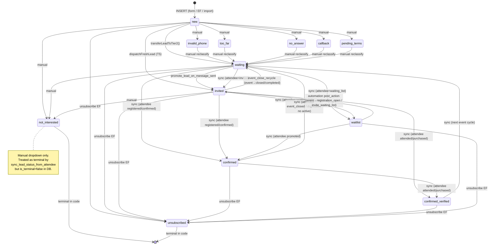
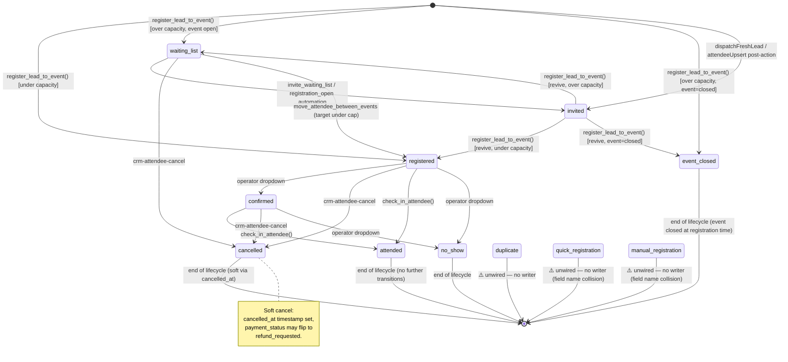
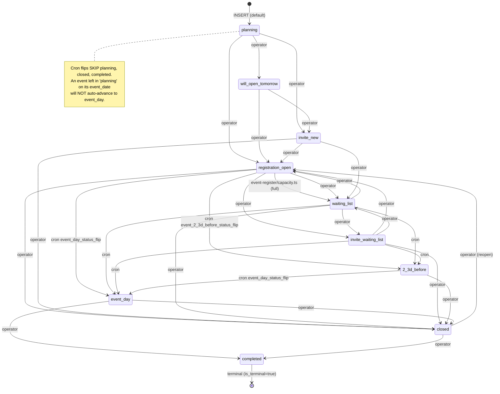

# Module 4 — Status Model

> **Source-of-truth doc for the three CRM state machines.**
> Generated 2026-05-14 by the Full Auto Pipeline executing
> `architecture-brief/M4_STATUS_MODEL_DOC_BRIEF.md`.
> Truth-from-code: every transition below is verifiable in DDL,
> `pg_proc` body, `cron.job` definition, `crm_automation_rules`, or
> `modules/crm/*.js` / `supabase/functions/*` as of the commit that
> introduces this file. Items the documentation-intent implies but
> the code does not support are marked **⚠️ unwired** and listed in
> §6.

---

## 1. Overview

### 1.1 The three machines

Module 4 — CRM — has three independent-but-coupled state machines:

| Entity | Column | Default | Slugs source |
|---|---|---|---|
| **Lead** | `crm_leads.status` | `'new'` | `crm_statuses WHERE entity_type='lead'` |
| **Attendee** | `crm_event_attendees.status` | `'registered'` | `crm_statuses WHERE entity_type='attendee'` |
| **Event** | `crm_events.status` | `'planning'` | `crm_statuses WHERE entity_type='event'` |

Each `crm_statuses` row carries `is_active`, `is_terminal`, `triggers_messages`, plus Hebrew/English labels. Both tenants (Prizma + demo) currently have **identical slug sets** — the per-tenant table exists for future divergence but is in lockstep today.

### 1.2 Why they exist

- **Lead status** drives operator queues ("who do I call next?") and broadcast-recipient filters (Tier 1 vs Tier 2 vs waitlist).
- **Attendee status** is the per-event registration record — one row per `(lead, event)` pair. The attendee is the relationship; the lead is the person.
- **Event status** drives lifecycle automation: when the operator (or cron) moves an event from `planning` → `registration_open`, automation rules dispatch invites; `closed` recycles leads back to `waiting`; `event_day` triggers same-day coupon push.

### 1.3 How they couple

Three coupling mechanisms exist (detailed in §5):
1. **`sync_lead_status_from_attendee`** RPC — derives the lead's status from its most-relevant attendee row.
2. **`event_status_close_recycle_leads_fn`** trigger — when an event closes/completes, leads with `invited`/`attended` attendee rows are recycled to lead.status=`waiting`.
3. **`crm_status_change_events`** queue + `consume_status_change_events` pg_cron + `automation-engine` consumer — a generic decoupled-event framework. Currently wired ONLY for attendee status changes (`crm_trigger_type_registry` has one registered entity_type: `attendee`).

### 1.4 Reading this doc

- Need to know what a slug means? Jump to the slug table for its machine (§2.1 / §3.1 / §4.1).
- Need to know what fires when status X is set? Jump to that machine's transition table (§2.3 / §3.3 / §4.3).
- Need to know what happens to other entities when status X is set? Jump to §5 Cross-Machine Coordination.
- Hunting a bug? §6 Open Issues lists every unwired slug and every code/data mismatch found while writing this doc.

---

## 2. Lead Status (`crm_leads.status`)

### 2.1 Slugs

13 slugs, all `is_active=true`, none marked `is_terminal` in `crm_statuses`. Two slugs share `sort_order=6` (collision — see §6).

| Slug | Hebrew label | Default? | triggers_messages | Notes |
|---|---|---|---|---|
| `new` | חדש | **yes** | false | Set on every lead INSERT (form, EF, RPC, import) |
| `invalid_phone` | מספר לא תקין | no | false | Manual-only; no code writes |
| `too_far` | רחוק מדי | no | false | Manual-only; no code writes |
| `no_answer` | לא עונה | no | false | Manual-only; no code writes |
| `callback` | להתקשר בחזרה | no | false | Manual-only; no code writes |
| `pending_terms` | לא אישר תקנון | no | false | Manual-only; no code writes; collides on sort_order=6 |
| `waiting` | ממתין לאירוע | no | false | Tier-2 promotion target; recycle target; `sync_lead_status_from_attendee` fallback |
| `invited` | הוזמן לאירוע | no | **true** | Set by `dispatchFreshLead` + `promote_lead_on_message_sent` trigger + `sync_lead_status_from_attendee` |
| `confirmed` | אישר הגעה | no | **true** | Set by `sync_lead_status_from_attendee` when attendee is `confirmed`/`registered`/`manual_registration`/`quick_registration`/`no_show` |
| `confirmed_verified` | אישר ווידוא | no | false | Set by `sync_lead_status_from_attendee` when attendee is `attended` or `purchased` |
| `not_interested` | לא מעוניין | no | false | Manual-only; **terminal in code** (sync_lead_status_from_attendee skips) |
| `unsubscribed` | הסיר מרשימה | no | **true** | Set by `unsubscribe` EF + cascades from automation; **terminal in code** |
| `waitlist` | רשימת המתנה | no | false | Set by `sync_lead_status_from_attendee` when attendee is `waiting_list` |

**Code-level terminal set:** `('not_interested','unsubscribed')` — checked at the top of `sync_lead_status_from_attendee`. These are the only slugs that block automatic re-derivation.

### 2.2 State diagram



> Operator-driven manual transitions to any slug are allowed via `crm-lead-actions.js::changeLeadStatus` — only the automatic edges are drawn above (drawing every manual edge would render the diagram unreadable).

### 2.3 Transitions table

| From | To | Trigger | Where |
|---|---|---|---|
| ∅ | `new` | INSERT (form, EF, RPC, import) | `lead-intake/index.ts:237`, `quick-register/index.ts:244`, `import_leads_from_monday` |
| `new`/`waiting` | `invited` | T5 fresh-lead path (existing open event found at intake) | `lead-intake/dispatch.ts:167` |
| `waiting` | `invited` | DB trigger: message to event was sent | `promote_lead_on_message_sent` (trg_promote_lead_on_message_sent on `crm_message_queue`) |
| any non-terminal | `invited`/`confirmed`/`confirmed_verified`/`waitlist`/`waiting` | RPC re-derives from active attendee | `sync_lead_status_from_attendee` RPC |
| any non-terminal w/ matching attendee | `waiting` | event→closed/completed recycles invited/attended attendees | `event_status_close_recycle_leads_fn` (trigger on `crm_events`) |
| any non-terminal | `unsubscribed` | one-click unsubscribe link | `unsubscribe/index.ts:217` |
| any non-terminal | `waiting` | "Transfer to Tier 2" operator action | `crm-lead-actions.js::transferLeadToTier2` |
| `waitlist` | `invited` | event→`registration_open` or `invite_waiting_list` automation rule with `post_action_attendee_upsert.status='invited'` (followed by sync) | `crm_automation_rules` rows "שינוי סטטוס: הזמנה חדשה" + "שינוי סטטוס: הזמנה ממתינים" + `post-actions.ts::attendeeUpsert` |
| `invited` → `waiting`, etc. | `waiting` | event→`closed` or `completed` automation rule with `post_action_status_update='waiting'` | `crm_automation_rules` rows "שינוי סטטוס: אירוע נסגר" + "שינוי סטטוס: אירוע הושלם" (`post-actions.ts::executePostActions`) |
| any | any | Operator picks a slug from the dropdown (writes a `crm_lead_notes` row + fires `lead_status_change` automation) | `crm-lead-actions.js::changeLeadStatus`, `bulkChangeStatus` |

### 2.4 Terminal slugs

`crm_statuses.is_terminal` is **false for every lead slug**. The terminal set used in code is hardcoded in `sync_lead_status_from_attendee`:

```sql
IF v_lead.status IN ('not_interested','unsubscribed') THEN
  RETURN ... 'terminal_status';
END IF;
```

Operator-driven manual changes can still move a lead OUT of `not_interested` or `unsubscribed` via the dropdown — terminality only blocks the *automatic re-derivation* path. The `unsubscribed_at` timestamp is also cleared on resubscribe (`crm-lead-actions.js::resubscribeLead`, `register_lead_to_event` RPC).

---

## 3. Attendee Status (`crm_event_attendees.status`)

### 3.1 Slugs

11 slugs, all `is_active=true`, none `is_terminal`. Note that `payment_status` is a **separate** column (slugs: `unpaid`, `paid`, `refund_requested`, `refunded`, `credit_pending`, `credit_used`, `pending_payment`) — that machine is not in scope here.

| Slug | Hebrew label | Notes |
|---|---|---|
| `registered` | חדש | **DB default**; set by `register_lead_to_event` RPC happy-path |
| `waiting_list` | רשימת המתנה | Set when capacity reached at register time; auto-promoted by `invite_waiting_list` automation |
| `duplicate` | כבר נרשם | Referenced as filter in capacity counts; **no writer found** — see §6 |
| `quick_registration` | רישום מהיר | Referenced in `sync_lead_status_from_attendee` as mapping to lead `confirmed`; **no writer found** in EF or client code (the field set is `registration_method`, not `status`) — see §6 |
| `event_closed` | אירוע נסגר | Set by `register_lead_to_event` when event capacity hit AND event already `closed` |
| `manual_registration` | נרשם ידנית | Same as `quick_registration` — referenced in sync mapping but **no writer found** — see §6 |
| `cancelled` | ביטל | Set by `crm-attendee-cancel.js`, `move_attendee_between_events` (old row), `register_lead_to_event` (no — registered overwrites cancelled) |
| `confirmed` | אישר (שילם) | Operator dropdown via UI; preserved through `move_attendee_between_events` |
| `attended` | הגיע | Set by `check_in_attendee` RPC |
| `no_show` | לא הגיע | Operator dropdown only |
| `invited` | הוזמן | Set by `dispatchFreshLead` (T5 upsert) + automation `post_action_attendee_upsert.status='invited'` for "שינוי סטטוס: הזמנה חדשה" rule |

### 3.2 State diagram



### 3.3 Transitions table

| From | To | Trigger | Where |
|---|---|---|---|
| ∅ | `registered` | Lead registers to event with capacity available | `register_lead_to_event` RPC |
| ∅ | `waiting_list` | Lead registers to event at/over capacity (event open) | `register_lead_to_event` RPC |
| ∅ | `event_closed` | Lead registers to a `closed` event over capacity | `register_lead_to_event` RPC |
| ∅ | `invited` | T5 fresh-lead path OR `event_status_change → invite_new` automation upserts attendee | `lead-intake/dispatch.ts:153`, `post-actions.ts::attendeeUpsert` |
| `invited` | `registered`/`waiting_list`/`event_closed` | Existing invited row promoted when lead registers | `register_lead_to_event` RPC |
| `waiting_list` | `invited` | Event flips to `registration_open` or `invite_waiting_list` → automation rule upserts attendee status='invited' | `crm_automation_rules` rule "שינוי סטטוס: הזמנה ממתינים" / "אירוע פתח להרשמה - הזמנת רשימת המתנה" + `attendeeUpsert` |
| any | `registered`/preserved | `move_attendee_between_events` to a different event | `move_attendee_between_events` RPC (old row → cancelled, new row → registered/waiting_list/preserved) |
| any | `cancelled` | Operator clicks cancel | `crm-attendee-cancel.js:73,106` |
| `registered`/`confirmed`/`invited` | `attended` | Check-in scan | `check_in_attendee` RPC |
| any (operator-allowed) | any (operator-allowed) | Manual dropdown | (No single chokepoint — direct `.update({status})` from client code) |
| any | (entry to queue) | DB trigger writes audit row to `crm_status_change_events` | `attendee_status_change_event_fn` (trg_attendee_status_change_event) |

### 3.4 Terminal-like slugs

No `is_terminal=true` in DB. In practice, lifecycle dead-ends are:

- `attended` — check-in already happened; no operator pathway in code writes back.
- `no_show` — operator-marked; no writer back to active.
- `cancelled` — soft-cancel; `move_attendee_between_events` blocks re-cancel via `IF v_src.status = 'cancelled' AND v_src.cancelled_at IS NOT NULL RAISE 'already_moved'`.
- `event_closed` — set only at register time when the event was already closed; no subsequent transition writes this slug back.

---

## 4. Event Status (`crm_events.status`)

### 4.1 Slugs

10 slugs, all `is_active=true`. **Only `completed` is `is_terminal=true` in DB.** Most have `triggers_messages=true`.

| Slug | Hebrew label | triggers_messages | Notes |
|---|---|---|---|
| `planning` | תכנון | false | **DB default**; operator builds the event here |
| `will_open_tomorrow` | נפתח מחר | **true** | Operator pre-announce; automation rule sends teaser |
| `registration_open` | הרשמה פתוחה | **true** | Drives invite-new automation + `event-register` capacity check |
| `invite_new` | הזמנת חדשים | **true** | Trigger for "invite new" automation (`post_action_attendee_upsert.status='invited'`) |
| `closed` | נסגר | **true** | Capacity reached or operator-closed; trigger for lead recycle |
| `waiting_list` | רשימת המתנה | **true** | Auto-set by `event-register` when capacity hits; also operator-settable |
| `2_3d_before` | 2-3 ימים לפני | **true** | Cron-set 3 days pre-event; queues 3-days-before broadcast |
| `event_day` | יום האירוע | **true** | Cron-set on event-date morning; triggers day-of broadcast |
| `invite_waiting_list` | הזמנת ממתינים | **true** | Operator-set; triggers waitlist→invited automation |
| `completed` | הושלם | false | **is_terminal=true**; recycles attendees' leads → `waiting` |

### 4.2 State diagram



> The "operator" edges above are not exhaustive — `crm-event-actions.js::changeEventStatus` accepts any slug from any source. The diagram shows the natural happy-path edges; any deviation is operator-driven.

### 4.3 Transitions table

| From | To | Trigger | Where |
|---|---|---|---|
| ∅ | `planning` | INSERT default | `crm_events.status DEFAULT 'planning'` |
| any except `event_day`/`planning`/`closed`/`completed` | `event_day` | Daily 5:30 IL pg_cron, when `event_date = today` | `cron.job` `event_day_status_flip` |
| any except `2_3d_before`/`event_day`/`planning`/`closed`/`completed` | `2_3d_before` | Daily 5:30 IL pg_cron, when `event_date = today + 3 days` | `cron.job` `event_2_3d_before_status_flip` |
| `registration_open` | `waiting_list` | Public/quick-registration EF detects capacity hit | `event-register/capacity.ts:46` |
| any | any | Operator picks slug from dropdown | `crm-event-actions.js::changeEventStatus` (line 230) |
| → `closed` or `completed` | (side-effect on leads) | DB trigger recycles invited/attended leads to `waiting` | `event_status_close_recycle_leads_fn` |
| any | (entry to automation engine) | Each status_change fires `event_status_change` evaluation | `crm-event-actions.js:215` → `CrmAutomationClient.evaluate` → `automation-engine` EF |

### 4.4 Terminal slug

`completed` is the only `is_terminal=true` slug across the entire CRM. No code writes a transition out of `completed`. The cron flips explicitly exclude it (`status NOT IN ('event_day','planning','closed','completed')`).

`closed` is **not** terminal in DB but is functionally a near-terminal: the only documented exit is operator-driven (reopen to `registration_open`, or finalize to `completed`).

---

## 5. Cross-Machine Coordination

Three coupling mechanisms tie the three machines together. Each is an independent code path — they do not subsume each other.

### 5.1 Attendee → Lead sync (`sync_lead_status_from_attendee`)

Called whenever an attendee row is created or its status changes via an RPC code path (`register_lead_to_event`, `move_attendee_between_events`, `post-actions.ts::attendeeUpsert`). Picks the most relevant active attendee for the lead and maps:

| Active attendee status | Resulting lead status |
|---|---|
| `confirmed` | `confirmed` |
| `registered` | `confirmed` |
| `manual_registration` | `confirmed` ⚠️ unwired source |
| `quick_registration` | `confirmed` ⚠️ unwired source |
| `attended` | `confirmed_verified` |
| `purchased` | `confirmed_verified` ⚠️ unwired source (no `purchased` slug) |
| `no_show` | `confirmed` |
| `invited` | `invited` |
| `waiting_list` | `waitlist` |
| `event_closed` | `waiting` |
| `duplicate` | `waiting` |
| (nothing active) | `waiting` |

**Selection priority:** waiting_list first (`CASE WHEN a.status = 'waiting_list' THEN 0 ELSE 1 END`), then most-recent timestamp among `confirmed_at`, `checked_in_at`, `purchased_at`, `registered_at`, `created_at`. Skipped entirely when the lead is `not_interested` or `unsubscribed` (the code-level terminal set).

**Not called from:** direct `.update({status})` writes in client code (`crm-attendee-cancel.js`, raw operator dropdowns). Those mutate the attendee row without re-syncing the lead — see §6.

### 5.2 Event-close → Lead recycle (`event_status_close_recycle_leads_fn`)

DB trigger on `crm_events` (AFTER UPDATE). When `NEW.status IN ('closed','completed')` AND `OLD.status NOT IN ('closed','completed')`:

```sql
UPDATE crm_leads SET status = 'waiting'
 WHERE tenant_id = NEW.tenant_id
   AND is_deleted = false
   AND status NOT IN ('not_interested','unsubscribed','waiting')
   AND EXISTS (
     SELECT 1 FROM crm_event_attendees a
      WHERE a.lead_id = l.id
        AND a.event_id = NEW.id
        AND a.is_deleted = false
        AND a.status IN ('invited','attended')
   );
```

The recycle scope is `invited` + `attended` attendees — `registered`, `confirmed`, `waiting_list`, `cancelled`, `no_show` rows do **not** recycle their leads via this trigger.

There is also an automation-rule path that recycles via `post_action_status_update`: rules "שינוי סטטוס: אירוע נסגר" (currently `is_active=false`) and "שינוי סטטוס: אירוע הושלם" (active) push `recipient_type` leads to `status='waiting'`. The trigger and the rule both target `waiting` but operate on different recipient sets — the trigger is attendee-scoped, the rule is recipient-resolver-scoped.

### 5.3 Waitlist priority

Two independent waitlist mechanisms:

- **Event-level waitlist** = the event's own `status='waiting_list'` (auto-set by `event-register/capacity.ts` when capacity is reached, or operator-set). Drives the "אירוע פתח להרשמה - הזמנת רשימת המתנה" automation rule that messages `leads_by_status=['waitlist']` when the event subsequently moves to `registration_open`.
- **Attendee-level waitlist** = `crm_event_attendees.status='waiting_list'` for individual late registrants. Selected first by `sync_lead_status_from_attendee` (priority CASE expression), so a lead with both an active attendee row AND a waiting_list row gets `lead.status='waitlist'`.

Both mechanisms target the same operator-visible audience but via different join paths.

### 5.4 The `crm_status_change_events` framework

Generic decoupled-event queue. Documented in its own brief (`architecture-brief/STATUS_CHANGE_TRIGGERS_FRAMEWORK_BRIEF.md`). Wiring as of this audit:

| Component | Status |
|---|---|
| Queue table `crm_status_change_events` | Live (2 rows total at audit time, both consumed) |
| Producer trigger `trg_attendee_status_change_event` on `crm_event_attendees` | Live |
| Producer trigger on `crm_leads` | **Not wired** |
| Producer trigger on `crm_events` | **Not wired** |
| Registry table `crm_trigger_type_registry` | Live, 1 row per tenant: `attendee → attendee_status_change` |
| Consumer pg_cron `consume_status_change_events` (per-minute) | Live |
| Consumer code path `automation-engine` EF mode `consume_status_events` | Live (`engine.ts::consumeStatusChangeEvents`) |
| `TRIGGER_TYPES` accepting `attendee_status_change` | Live (`engine.ts:20`) |

Event status changes still fire automation rules via the **direct dispatch path** (`crm-event-actions.js::changeEventStatus` → `CrmAutomationClient.evaluate('event_status_change', …)` → `automation-engine` EF in `dispatch` mode). They do not pass through the queue. Same for `lead_status_change` (from `crm-lead-actions.js::changeLeadStatus`) and the four other registered trigger types (`event_registration`, `lead_intake`, `attendee_moved`, `attendee_status_change`).

**Therefore: the queue framework today is a parallel, attendee-only audit + dispatch path** that runs alongside the existing in-process dispatches. If/when more entity types get registered (lead, event) **plus** matching producer triggers, the queue becomes the canonical decoupled bus.

---

## 6. Open Issues + Anti-Patterns

Items surfaced by writing this doc. Per Brief §3.4 these are **not** authored into fix SPECs here — Daniel + Architect read this section and decide what becomes a SPEC.

### 6.1 Dead/unwired slugs

| Slug | Machine | Why dead | Recommended action |
|---|---|---|---|
| `quick_registration` | attendee | `crm_event_attendees.status` is never set to this value; the field that takes this value is `registration_method`. `sync_lead_status_from_attendee` maps it as if it were a status (→ lead.confirmed). Either the row is unreachable or the mapping is dead code. | Decide: rename the slug to clarify it's a `registration_method` value, OR add a code path that actually writes `status='quick_registration'`. |
| `manual_registration` | attendee | Same situation as `quick_registration`. | Same. |
| `duplicate` | attendee | `register_lead_to_event` filters `status NOT IN ('cancelled','duplicate')` in capacity counts, but no code writes `status='duplicate'`. Likely a legacy slug. | Audit history for the original writer; either restore or remove. |
| `invalid_phone`, `too_far`, `no_answer`, `callback`, `pending_terms` | lead | Exist in `crm_statuses` (active). Only manual-dropdown writes. No automation reads them. | Probably intentional (operator triage slugs). Document as such or move out of the main machine. |

### 6.2 Slugs referenced in code that do not exist in `crm_statuses`

These are the inverse of §6.1 — the code expects a slug that `crm_statuses` doesn't define:

| Slug | Machine | Where referenced | Risk |
|---|---|---|---|
| `purchased` | attendee | `move_attendee_between_events` (`v_src.status IN ('confirmed','attended','purchased')`), `sync_lead_status_from_attendee` (mapping table) | Status would never appear in DB unless a forgotten writer exists — verify, then drop refs or define the slug. |
| `cancelled` | event | `register_lead_to_event` (`e.status NOT IN ('completed','cancelled')`), `sync_lead_status_from_attendee` (`e.status NOT IN ('completed','cancelled')`), `move_attendee_between_events` | If an operator cannot set an event to `cancelled`, these guards never fire. Either add the slug or remove the dead guards. |

### 6.3 Ambiguous semantics

| Pair | Ambiguity | Code observation |
|---|---|---|
| Lead `confirmed` vs `confirmed_verified` | "Confirmed" = attendee said "I'll come" (registered/confirmed/no_show/etc.). "Confirmed verified" = attendee actually showed up (attended/purchased). Names don't make that distinction visually for operators. | `sync_lead_status_from_attendee` mapping is the only source of truth — not stated anywhere in the UI. |
| Lead `waiting` vs `waitlist` | `waiting` = "between events, expecting to be invited again". `waitlist` = "currently on an event's overflow waitlist". Visually nearly identical to a Hebrew-reading operator (ממתין לאירוע vs רשימת המתנה). | These mean very different things to automation: `waiting` is the Tier-2 active pool; `waitlist` is event-specific overflow. |
| Event `waiting_list` vs Attendee `waiting_list` | Same slug for two different entities — works because of `entity_type` scoping but reads ambiguously in logs. | Operator-facing labels (רשימת המתנה) are identical, even though "event in waiting_list state" and "attendee in waiting_list state" describe different facts. |

### 6.4 Coupling gaps

1. **Direct `.update({status})` writes bypass the sync RPC.** Examples:
   - `crm-attendee-cancel.js:73,106` updates attendee → `cancelled` directly. Lead is not re-synced. A lead whose only active attendee row is cancelled keeps stale `status='confirmed'` until a later sync trigger fires.
   - Operator dropdown attendee status changes (if any — not all writers traced) write directly without calling `sync_lead_status_from_attendee`.
2. **The `crm_status_change_events` queue is producer-asymmetric.** Attendee changes are queued, lead and event changes are not. A monitoring dashboard reading the queue therefore sees only one third of the system's status-change volume.
3. **`event_status_close_recycle_leads_fn` and the closed/completed automation rules both recycle to `waiting`.** Two parallel paths to the same target with different recipient scopes. If one fires successfully and the other doesn't, the operator sees a partial recycle.
4. **`pending_terms` and `waiting` share `sort_order=6`** in lead statuses on both tenants. The dropdown order between them is non-deterministic.

### 6.5 Cron quirk

`event_day_status_flip` and `event_2_3d_before_status_flip` both exclude `status NOT IN ('event_day','planning','closed','completed')`. **Excluding `planning` is significant:** an event left in `planning` on its event date will NOT auto-flip. This is presumably intentional (the operator hadn't opened registration so the event isn't real), but operators who think "everything flips on its date" will be surprised.

### 6.6 Terminal-state DB metadata is misaligned with code

`crm_statuses.is_terminal` is `false` for every lead/attendee slug — including `not_interested` and `unsubscribed`, which `sync_lead_status_from_attendee` explicitly treats as terminal. Either the column is unused (in which case drop it) or it should be backfilled to match code behavior.

### 6.7 Disabled automation rule that names `'unpaid'` / `'paid'` as attendee status

Two active rules ("העברת משתתף ידנית - לא שילם", "העברת משתתף ידנית - שילם") condition on `trigger_event='moved'` with `trigger_condition.status` of `'unpaid'` and `'paid'`. Those values are **payment_status**, not the main `status` field. The `attendee_moved` trigger receives `newStatus` from `move_attendee_between_events` payload — if the dispatcher is passing `payment_status` into the `newStatus` slot, this works; if not, the rules silently never fire. Worth a focused investigation.

---

## 7. How to Extend

### 7.1 Adding a new status slug

1. **Decide which machine** it belongs to (`lead`/`attendee`/`event`).
2. **Insert into `crm_statuses` for every tenant** (this is per-tenant config — both Prizma and demo today, but new tenants get their own seeded copy). Match the existing field set: `slug`, `name_he`, `name_en`, `color`, `icon`, `sort_order`, `is_default`, `is_terminal`, `triggers_messages`, `is_active`. The migration in `migrations/` is the canonical insert.
3. **RLS:** `crm_statuses` already has the canonical two-policy RLS pair (`service_bypass` + `tenant_isolation` with the JWT-claims clause). No new policy needed for new rows.
4. **UI dropdown** at `crm-event-actions.js::openEventStatusDropdown`, `crm-lead-modals.js`, `crm-attendee-*` files: the dropdown reads `window.CRM_STATUSES._all` so the new slug appears automatically once the row is seeded. No code change required for visibility.
5. **Update §2.1 / §3.1 / §4.1 of this doc** in the same commit.

### 7.2 Adding a new transition

1. **Pick the trigger surface:**
   - **DB trigger** (most reliable): write a `BEFORE/AFTER UPDATE` trigger on the target table, gated on `OLD.status IS DISTINCT FROM NEW.status`. Model on `event_status_close_recycle_leads_fn` or `attendee_status_change_event_fn`.
   - **Automation rule** (operator-configurable): insert a row into `crm_automation_rules` with `trigger_entity` + `trigger_event` + `trigger_condition` (use `status_equals`, `status_changed_from`, or `status_changed_to`) + `action_type` (`send_message` or `queue_send`) + optional `post_action_status_update` / `post_action_attendee_upsert` for cascade writes.
   - **Code path** (when neither fits): add the write to the appropriate `modules/crm/*.js` or Edge Function. Always pair attendee writes with a `sync_lead_status_from_attendee` call.
2. **If the source/target slug is in another machine** (e.g., attendee→lead derivation), update `sync_lead_status_from_attendee`'s mapping CASE in a migration. Add the slug + reason in a comment.
3. **If the transition is automatic and high-volume**, prefer the `crm_status_change_events` queue + consumer (see §7.3) over a synchronous in-process dispatch.
4. **Update the transition table for that machine in this doc** in the same commit (§2.3 / §3.3 / §4.3).

### 7.3 Adding a new entity to the queue framework

1. **Add a `crm_trigger_type_registry` row** for the entity_type + trigger_type slug, per tenant. The current row pattern is `('attendee', 'attendee_status_change', ['status_equals','status_changed_from','status_changed_to'], true)`.
2. **Add the producer trigger** on the target table (lead or event), modeled on `attendee_status_change_event_fn`. The function must `INSERT INTO crm_status_change_events (tenant_id, entity_type, entity_id, old_status, new_status, payload) VALUES (...)` and `RETURN NEW`.
3. **Register the trigger_type in `automation-engine`** by adding it to `TRIGGER_TYPES` in `engine.ts:14` (and the mirror copy in `modules/crm/crm-automation-engine.js`).
4. **Verify the consumer path** in `engine.ts::consumeStatusChangeEvents` — it reads `registryMap.get(e.entity_type)` so the new entity type just works once registered.
5. **Decommission the legacy in-process dispatch** for that entity if you want a clean single path. (E.g., once `lead` is on the queue, `crm-lead-actions.js::fireLeadStatusAutomation` could be deleted.)

### 7.4 SaaS-readiness checks

- Any new slug **must** be seeded per-tenant — never a hardcoded enum (Iron Rule 19).
- Any new transition that filters by `tenant_id` **must** include the JWT-claims tenant check if the path is reachable from anon role (Rule 14 + 22).
- Any new column added to `crm_statuses` itself is in the SaaS critical path — propagate to `docs/GLOBAL_SCHEMA.sql` at Integration Ceremony.

---

*End of STATUS_MODEL.md. If a future edit changes a transition, update both the diagram AND the table for that machine — keep them in lockstep.*
