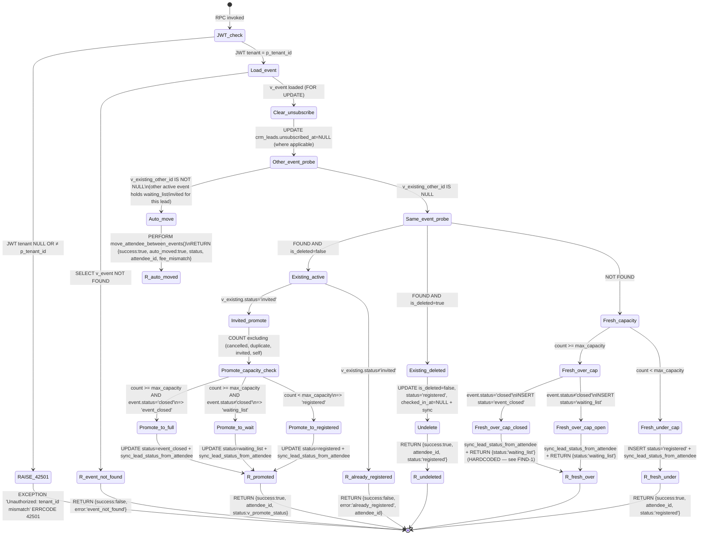

# `register_lead_to_event` — State Transitions, Annotations, Callers, Forward-Compat

> **Source-of-truth:** `RPC_BODY.sql` in this folder. Byte-identical with live `pg_proc` (md5 = `dbd2ccd1eb068b494edfec5cf7788563`, length = 4603) at 2026-05-14 12:17:56+00.
> **RPC signature:** `register_lead_to_event(p_tenant_id uuid, p_lead_id uuid, p_event_id uuid, p_method text DEFAULT 'manual') RETURNS jsonb` — `SECURITY DEFINER`, `search_path = public`.

---

## 1. State Diagram

---

## 2. Line-Annotation Table

Line numbers reference `RPC_BODY.sql` in this folder.

| Line | Statement summary | Reads from | Writes to | Side effects |
|------|---|---|---|---|
| L01–L05 | Function header: `SECURITY DEFINER`, `search_path=public`, `LANGUAGE plpgsql`, `RETURNS jsonb`, default `p_method='manual'`. | n/a | n/a | All callers execute as definer's role — bypasses callers' privileges. |
| L07–L13 | DECLARE block: `v_event` (rowtype), `v_current_count`, `v_attendee_id`, `v_existing` (record), `v_existing_other_id`, `v_move_result` (jsonb), `v_promote_status`, `v_jwt_tenant` (read from JWT claim `tenant_id`, `nullif(...,'')::uuid`). | `current_setting('request.jwt.claims', true)` JSON | n/a | None — variable init. |
| L14–L16 | `IF v_jwt_tenant IS NULL OR v_jwt_tenant <> p_tenant_id THEN RAISE EXCEPTION 'Unauthorized: tenant_id mismatch' USING ERRCODE = '42501'` | JWT claim | n/a | Hard fail with sqlstate `42501`. Iron Rule 22 belt+suspenders alongside RLS. Terminal branch. |
| L17 | `SELECT * INTO v_event FROM crm_events WHERE id=p_event_id AND tenant_id=p_tenant_id FOR UPDATE` | `crm_events` (row-locked) | n/a | Row lock on the target event for the transaction's duration. Prevents concurrent capacity overrun (Iron Rule 11 pattern). |
| L18–L19 | `IF NOT FOUND THEN RETURN jsonb_build_object('success', false, 'error', 'event_not_found')` | n/a | n/a | Terminal return. No side effects. |
| L20–L21 | `UPDATE crm_leads SET unsubscribed_at=NULL, updated_at=now() WHERE id=p_lead_id AND tenant_id=p_tenant_id AND unsubscribed_at IS NOT NULL` | n/a | `crm_leads` (conditional) | Resubscribe-on-register pattern. Documented in `modules/Module 4 - CRM/docs/STATUS_MODEL.md:160`. Triggers `update_updated_at` trigger if defined. **No status-change events generated for `unsubscribed_at` clear** (only `status` column flips emit events per STATUS_CHANGE_TRIGGERS_FRAMEWORK). See FIND-5. |
| L22–L26 | `SELECT a.id INTO v_existing_other_id FROM crm_event_attendees a JOIN crm_events e ON e.id = a.event_id WHERE a.lead_id=p_lead_id AND a.tenant_id=p_tenant_id AND a.event_id <> p_event_id AND a.status IN ('waiting_list','invited') AND a.is_deleted=false AND e.status NOT IN ('completed','cancelled') AND e.is_deleted=false ORDER BY a.created_at DESC LIMIT 1` | `crm_event_attendees`, `crm_events` | n/a | Probes for a "lead already on waiting_list/invited for another active event" condition. The OLDEST-FIRST ordering is `ORDER BY a.created_at DESC LIMIT 1` — i.e., **most recent** other-event row wins. |
| L27 | `IF v_existing_other_id IS NOT NULL THEN ...` | n/a | n/a | Branch: auto-move path. |
| L28 | `v_move_result := move_attendee_between_events(v_existing_other_id, p_event_id)` | n/a | `crm_event_attendees` (via callee), `crm_event_attendees` event swap (via callee). | Delegates to `move_attendee_between_events` (separate RPC — not analyzed in this SPEC). Returns `{new_attendee_id, new_status, fee_mismatch}` per usage on L30. |
| L29–L32 | `RETURN jsonb_build_object('success', true, 'auto_moved', true, 'attendee_id', v_move_result->>'new_attendee_id', 'status', v_move_result->>'new_status', 'fee_mismatch', (v_move_result->>'fee_mismatch')::boolean)` | n/a | n/a | Terminal return for auto-move branch. `fee_mismatch` is only present on this branch. See FIND-4. |
| L33–L34 | `SELECT id, is_deleted, status INTO v_existing FROM crm_event_attendees WHERE tenant_id=p_tenant_id AND lead_id=p_lead_id AND event_id=p_event_id` | `crm_event_attendees` | n/a | Probes for existing row in THIS event. |
| L35 | `IF FOUND THEN ...` (existing attendee row in this event exists) | n/a | n/a | Branch: pre-existing same-event row path. |
| L36 | `IF v_existing.is_deleted = false THEN ...` (active row) | n/a | n/a | Sub-branch: active vs soft-deleted. |
| L37 | `IF v_existing.status = 'invited' THEN ...` (promotion path) | n/a | n/a | Sub-sub-branch: invited → registered/waiting_list/event_closed. |
| L38–L42 | `SELECT COUNT(*) INTO v_current_count FROM crm_event_attendees WHERE event_id=p_event_id AND tenant_id=p_tenant_id AND status NOT IN ('cancelled','duplicate','invited') AND is_deleted=false AND id <> v_existing.id` | `crm_event_attendees` | n/a | Capacity probe excluding cancelled, duplicate, invited, self. This is the Iron-Rule-11 atomic capacity gate (held by FOR UPDATE on v_event above). |
| L43 | `IF v_current_count >= v_event.max_capacity THEN` | n/a | n/a | Capacity check. |
| L44 | `v_promote_status := CASE WHEN v_event.status='closed' THEN 'event_closed' ELSE 'waiting_list' END` | n/a | n/a | Sets new status. |
| L45 | `ELSE v_promote_status := 'registered'` | n/a | n/a | Under-capacity case. |
| L47–L48 | `UPDATE crm_event_attendees SET status=v_promote_status, registration_method=p_method WHERE id=v_existing.id AND tenant_id=p_tenant_id` | n/a | `crm_event_attendees` (1 row) | Status flip on existing invited row. **Emits `crm_status_change_events` row** via the attendee status trigger (per STATUS_CHANGE_TRIGGERS_FRAMEWORK). |
| L49 | `PERFORM sync_lead_status_from_attendee(p_lead_id, p_tenant_id)` | `crm_event_attendees`, `crm_events` | `crm_leads.status` (potentially) | Reconciles `crm_leads.status` to lead's most-relevant active attendee. May emit a lead-status `crm_status_change_events` row. |
| L50 | `RETURN jsonb_build_object('success', true, 'attendee_id', v_existing.id, 'status', v_promote_status)` | n/a | n/a | Terminal — invited promotion. Returns the ACTUAL v_promote_status — consistent with row. |
| L51 | `ELSE` (active row, status ≠ 'invited') | n/a | n/a | Sub-sub-branch: already_registered. |
| L52 | `RETURN jsonb_build_object('success', false, 'error', 'already_registered', 'attendee_id', v_existing.id)` | n/a | n/a | Terminal — duplicate registration. No DB writes in this branch beyond the L20 unsubscribe clear. |
| L53 | `ELSE` (is_deleted = true) | n/a | n/a | Soft-deleted row revival path. |
| L54–L56 | `UPDATE crm_event_attendees SET is_deleted=false, status='registered', registration_method=p_method, checked_in_at=NULL WHERE id=v_existing.id AND tenant_id=p_tenant_id` | n/a | `crm_event_attendees` (1 row) | Revives the soft-deleted row to registered. **NOTE:** this branch IGNORES capacity — a revival can overflow `max_capacity`. Documented behavior (no fix needed) — soft-delete revival is a privileged operator action. |
| L57 | `PERFORM sync_lead_status_from_attendee(p_lead_id, p_tenant_id)` | as above | `crm_leads.status` | As above. |
| L58 | `RETURN jsonb_build_object('success', true, 'attendee_id', v_existing.id, 'status', 'registered')` | n/a | n/a | Terminal — undelete. |
| (post L62 END IF) | Fall-through: no existing row in this event for this lead. | | | |
| L63–L66 | `SELECT COUNT(*) INTO v_current_count FROM crm_event_attendees WHERE event_id=p_event_id AND tenant_id=p_tenant_id AND status NOT IN ('cancelled','duplicate','invited') AND is_deleted=false` | `crm_event_attendees` | n/a | Fresh-insert capacity probe (same exclusion list as L38 but no `id <> self`). |
| L67 | `IF v_current_count >= v_event.max_capacity THEN ...` | n/a | n/a | Fresh-insert over-capacity branch. |
| L68–L71 | `INSERT INTO crm_event_attendees (tenant_id, lead_id, event_id, status, registration_method) VALUES (p_tenant_id, p_lead_id, p_event_id, CASE WHEN v_event.status='closed' THEN 'event_closed' ELSE 'waiting_list' END, p_method) RETURNING id INTO v_attendee_id` | n/a | `crm_event_attendees` (1 new row) | INSERT with status `event_closed` OR `waiting_list` depending on event state. Trigger emits `crm_status_change_events` (NULL→status). |
| L72 | `PERFORM sync_lead_status_from_attendee(p_lead_id, p_tenant_id)` | as above | `crm_leads.status` | As above. |
| L73 | `RETURN jsonb_build_object('success', true, 'attendee_id', v_attendee_id, 'status', 'waiting_list')` | n/a | n/a | **FIND-1:** literal `'waiting_list'` — does NOT reflect actual row status when `v_event.status='closed'` (row inserted as `event_closed`). |
| L74 | `INSERT INTO crm_event_attendees (..., status='registered', registration_method=p_method) RETURNING id INTO v_attendee_id` | n/a | `crm_event_attendees` (1 new row) | Fresh-insert under-capacity branch. |
| L77 | `PERFORM sync_lead_status_from_attendee(p_lead_id, p_tenant_id)` | as above | `crm_leads.status` | As above. |
| L78 | `RETURN jsonb_build_object('success', true, 'attendee_id', v_attendee_id, 'status', 'registered')` | n/a | n/a | Terminal — fresh registered. Consistent with row. |

**Branch counters (Executor verification):**
- Outer `IF`: 1 (JWT)
- `IF NOT FOUND`: 1 (event lookup)
- Outer `IF v_existing_other_id IS NOT NULL`: 1 (auto-move)
- Outer `IF FOUND` (same event): 1, with nested:
  - `IF is_deleted=false`: 1, with nested:
    - `IF status='invited'`: 1, with nested:
      - `IF count>=max_capacity` … `ELSE`: 1 (with CASE WHEN inside)
    - `ELSE` (already_registered): 1
  - `ELSE` (is_deleted=true revival): 1
- Fall-through `IF count>=max_capacity`: 1 (with CASE WHEN inside)
- 1 fall-through `ELSE`-implicit under-capacity fresh registered

**Total distinct terminal outcomes = 8** (7 RETURN paths + 1 RAISE EXCEPTION). Each is a row in §3.

---

## 3. Return-Value Semantics

| # | Terminal | Trigger condition | Return shape (jsonb) | Consumers | Consumer handling |
|---|---|---|---|---|---|
| T1 | `RAISE EXCEPTION '42501'` | JWT claim missing / mismatched | Throws — Postgres error `Unauthorized: tenant_id mismatch` (sqlstate 42501) | All 3 callers receive `res.error` (PostgREST translates) | ERP: `throw new Error('register_lead_to_event: ' + res.error.message)`. event-register EF: returns 500 with `{success:false, error:'rpc_failed', detail}`. quick-register EF: returns 500 `errorResponse('rpc_failed')`. |
| T2 | `{success:false, error:'event_not_found'}` | Event row missing or wrong tenant | `{success:false, error:'event_not_found'}` | Same callers | ERP: throws (no special-case). event-register EF: passes back via `result.success` false-path; user sees fallback message. quick-register EF: `errorResponse(result.error || 'register_failed', 409)`. |
| T3 | `{success:true, auto_moved:true, attendee_id, status, fee_mismatch}` | Lead has waiting_list/invited row on a DIFFERENT active event → moved to target event | `{success:true, auto_moved:true, attendee_id:<uuid>, status:<text from move RPC>, fee_mismatch:<bool>}` | Same callers | ERP: `data.status === 'registered'` check fires `checkAndAutoWaitingList`; `auto_moved` flag not consumed in ERP. event-register EF: passes through `result.status` to caller; `auto_moved` not consumed (storefront unaware). quick-register EF: same. |
| T4 | `{success:true, attendee_id, status:<v_promote_status>}` (invited→promote) | Existing invited row in same event; promote to registered / waiting_list / event_closed based on capacity + event.status | Where `<v_promote_status>` ∈ {`registered`, `waiting_list`, `event_closed`} | Same callers | ERP: depending on status, may fire `checkAndAutoWaitingList`. EFs: status passed through to storefront message rendering. |
| T5 | `{success:false, error:'already_registered', attendee_id}` | Existing same-event row with status ≠ 'invited' AND is_deleted=false | `{success:false, error:'already_registered', attendee_id:<uuid>}` | Same callers | ERP: throws. event-register EF: passes through (storefront sees error="already_registered"). quick-register EF: pre-empts this branch — its own dedup check at L295-305 catches existing-attendee BEFORE calling the RPC, returning `{status:'already_registered'}` 200 OK. So the RPC's T5 path is largely unreachable from quick-register. |
| T6 | `{success:true, attendee_id, status:'registered'}` (undelete) | Existing same-event row, `is_deleted=true` → revived as registered | Always `registered` | Same callers | ERP/EFs: same as fresh-registered handling (T8). |
| T7 | `{success:true, attendee_id, status:'waiting_list'}` (fresh over-cap) | No existing same-event row, count ≥ max_capacity, row inserted with `event_closed` if event.status='closed' else `waiting_list` | Literal `'waiting_list'` returned regardless of inserted status (FIND-1) | Same callers | ERP: does NOT fire `checkAndAutoWaitingList` (status ≠ 'registered'). EFs: storefront shows "waiting list" message even when row is actually `event_closed`. |
| T8 | `{success:true, attendee_id, status:'registered'}` (fresh under-cap) | No existing same-event row, count < max_capacity | Always `registered` | Same callers | ERP: fires `checkAndAutoWaitingList(eventId)` to populate the next-in-line waiting-list row if any. EFs: storefront shows "registered" confirmation. |

**Side-effect summary (all happy-path returns):**
- 0 or 1 row insert into `crm_event_attendees`
- 0 or 1 row update to `crm_event_attendees` (promote / undelete / via move)
- 0 or 1 row update to `crm_leads.unsubscribed_at` (always-conditional via L20)
- 0 or 1 row update to `crm_leads.status` (via `sync_lead_status_from_attendee`)
- 0..N rows inserted into `crm_status_change_events` (via attendee + lead status triggers)
- Downstream: the `consume_status_change_events` pg_cron job (every minute) processes the event-bus rows and may enqueue messages into `crm_message_queue`

---

## 4. Caller Inventory

| Surface | File:line | Invocation | Parameter values passed | Return-value handling |
|---|---|---|---|---|
| ERP JS | `modules/crm/crm-event-register.js:76` | `sb.rpc('register_lead_to_event', {...})` | `p_tenant_id = _regTid()` (resolved from session); `p_lead_id = leadId`; `p_event_id = eventId`; `p_method = method ‖ 'manual'` (callers pass `'staff_picker'` or `'event_day_attendee_add'` based on entry point) | If `res.error` → throws. If `data.success && data.status === 'registered'` → fires `checkAndAutoWaitingList(eventId)`. Returns `data` (raw RPC result) to caller. |
| Edge Function | `supabase/functions/event-register/index.ts:270` | `db.rpc('register_lead_to_event', {...})` | `p_tenant_id = body.tenant_id`; `p_lead_id = body.lead_id`; `p_event_id = body.event_id`; `p_method = 'form'` (hardcoded) | If `rpcRes.error` → `500 {success:false, error:'rpc_failed', detail}`. On success: patches form-specific fields (`scheduled_time`, `eye_exam_needed`, `client_notes`) onto the new attendee row, then triggers downstream registration-message dispatch. Reads `result.success`, `result.status`, `result.attendee_id` from the RPC return jsonb. |
| Edge Function | `supabase/functions/quick-register/index.ts:308` | `db.rpc('register_lead_to_event', {...})` | `p_tenant_id = tenantId` (resolved from token); `p_lead_id = leadId` (resolved via create-or-find lead); `p_event_id = event.id` (resolved from token); `p_method = SOURCE_TAG` (i.e. `'quick_register_qr'`) | If `rpcRes.error` → `500 errorResponse('rpc_failed')`. If `!result.success` → `409 {ok:false, error}`. Otherwise: dispatches `coupon-delivery` or `waiting-list` template via `dispatchQuickRegister` and returns `{ok:true, status, coupon_available, lead_id, attendee_id}`. Pre-empts T5 path with its own dedup check at lines 295–305. |
| SQL (legacy migration) | `campaigns/supersale/migrations/001_crm_schema.sql:838` | Original `CREATE OR REPLACE FUNCTION register_lead_to_event(...)` definition. | n/a — schema definition, not invocation. | n/a |
| SQL (current migrations) | `modules/Module 4 - CRM/migrations/2026_05_13_invited_ghost_attendee_fix_up.sql:70` + `modules/Module 2 - Platform Admin/migrations/2026_05_13_security_hotfix_04_mutator_rpcs_jwt_gate_up.sql:311` | `CREATE OR REPLACE FUNCTION ...` — most-recent body changes (May-13: invited-ghost fix; May-13: JWT-claim gate + `SET search_path` hardening). | n/a — schema definition. | n/a |
| Make scenarios | None active. Storefront forms route via `lead-intake` EF or `event-register` EF directly. Legacy Make scenarios in `_archive/` reference the RPC by name but are inactive (per `roles/site-overseer/FUNNEL_ROADMAP.md` Q9, kept until Q4 2026). | n/a | n/a | n/a |
| Storefront repo (Astro) | **Not directly invoked.** The Astro/TS storefront posts to `event-register` EF or `quick-register` EF; the RPC call lives in those EFs. No direct `db.rpc` call from storefront client code. Verified by absence of grep hits inside `.ts`/`.astro` files that aren't `supabase/functions/`. | n/a | n/a | n/a |
| Docs / SPECs / Briefs | 30+ documentation hits across `docs/`, `roles/site-overseer/`, `campaigns/`, `modules/*/docs/`. Informational only — no runtime calls. | n/a | n/a | n/a |

**Total live runtime callers: 3** (1 ERP JS + 2 Edge Functions). All three pass `p_method` as the meaningful provenance tag — useful for future P2.5 attribution analysis if extended into `crm_event_attendees.registration_method`.

---

## 5. Forward-Compat Cross-Check (FUNNEL_ROADMAP §"Phase 4" E1–E7)

For each elite-tier capability, verdict on whether the current RPC structure blocks, supports, or is N/A for that capability.

| # | Capability | Verdict | Rationale (1 sentence) |
|---|---|---|---|
| E1 | Multi-Touch Attribution (MTA) Engine | **BLOCK** | RPC writes no touchpoint log — only mutates state on `crm_event_attendees` + `crm_leads`. No `crm_lead_touchpoints` table exists; structured event log is partial (only `crm_status_change_events` via triggers, which captures status flips but not UTM/source attribution per touchpoint). FIND-2. |
| E2 | Predictive LTV → CAC per channel | **SUPPORT (partial)** | The RPC writes `registration_method` (the `p_method` parameter — `'manual' / 'form' / 'quick_register_qr' / 'staff_picker' / 'event_day_attendee_add'`) onto each attendee row. This is a coarse acquisition-source tag suitable for grouping but not per-source CAC. Full E2 requires per-UTM, per-broadcast attribution which currently bypasses this RPC (UTMs live on `crm_leads.utm_*` via lead-intake EF, not on attendees). |
| E3 | Audience Segmentation auto-export | **N/A** | Audience export operates on `crm_customers` / `crm_leads` after enrichment; not in this RPC's path. RPC is registration-only. |
| E4 | Creative A/B at scale | **N/A** | `creative_id` propagation belongs upstream (broadcast/short-link → lead-intake → lead row). The registration RPC consumes attribution that was already persisted; it doesn't generate or carry creative_id. |
| E5 | Real-time anomaly detection | **SUPPORT** | RPC writes status-change events (via triggers) that the consumer EF + dashboard query can detect anomalies on (capacity exhaustion, surge in `waiting_list` returns, etc.). No RPC change needed. |
| E6 | Cross-channel orchestration | **N/A** | `chain_id` / `parent_message_id` concerns belong to the messaging layer (`crm_message_queue`), not the registration RPC. RPC enqueues no messages directly; downstream automation rules + the bus consumer do. |
| E7 | Customer Journey Analytics | **BLOCK (partial)** | RPC mutates state without writing a structured "registration event" row to a unified journey log. The `crm_status_change_events` table captures status flips downstream of this RPC but loses semantic context (a "registered → event_closed" promotion looks the same as a "registered → cancelled" cancel in raw event terms). A unified `crm_customer_journey_events` table or extending `crm_status_change_events` with a `journey_event_type` enum would unblock E7. FIND-2 partial. |

**Verdict summary:** 2 BLOCK (E1, E7), 2 SUPPORT (E2 partial, E5), 3 N/A (E3, E4, E6).

The BLOCKs are not lethal — both are addressable in a future SPEC. E1 specifically requires Phase 1 P1.1 (`M3_UTM_TRIPLE_LAYER_PERSISTENCE`) to either:
- Add a `crm_lead_touchpoints` table that captures every UTM hit per lead (then this RPC remains touchpoint-agnostic — touchpoints land via lead-intake EF, registration is one of many events on the journey), OR
- Extend `crm_event_attendees` with per-row `utm_source`, `utm_medium`, `utm_campaign`, `utm_content` columns + have this RPC capture them from the call-site or from a separate context table.

The Architect's note in FUNNEL_ROADMAP §"Phase 2.5 — SPEC-authoring impact" already flags the requirement to capture broadcast attribution on `crm_event_attendees` — this aligns.

---

## 6. Quick-Reference Decision Table — "What does the RPC do when…"

| Scenario | Outcome | RPC return shape `status` | Row state |
|---|---|---|---|
| JWT tenant ≠ p_tenant_id | RAISE 42501 | n/a (exception) | unchanged |
| Event not found / wrong tenant | RETURN | n/a (success=false) | unchanged |
| Lead has waiting_list/invited on OTHER active event | Auto-move via `move_attendee_between_events` | `<from move RPC>` (typically `registered` or `waiting_list`) | OLD event row cancelled by move RPC; NEW row created |
| Existing same-event row, status=`invited`, capacity available | Promote to `registered` | `registered` | UPDATE row.status=registered |
| Existing same-event row, status=`invited`, capacity full, event open | Promote to `waiting_list` | `waiting_list` | UPDATE row.status=waiting_list |
| Existing same-event row, status=`invited`, capacity full, event=`closed` | Promote to `event_closed` | `event_closed` | UPDATE row.status=event_closed |
| Existing same-event row, status ∈ {`registered`,`waiting_list`,`confirmed`,`attended`,`event_closed`,`cancelled`} | Reject as duplicate | n/a (success=false, error=`already_registered`) | unchanged |
| Existing same-event row, is_deleted=true | Revive as `registered` (ignores capacity!) | `registered` | UPDATE row.is_deleted=false, status=registered, checked_in_at=NULL |
| No existing same-event row, capacity available | Fresh INSERT as `registered` | `registered` | INSERT new row |
| No existing same-event row, capacity full, event open | Fresh INSERT as `waiting_list` | `waiting_list` | INSERT new row, status=waiting_list |
| No existing same-event row, capacity full, event=`closed` | Fresh INSERT as `event_closed` | **`waiting_list`** ← **FIND-1 inconsistency** | INSERT new row, status=event_closed |
| Lead has `unsubscribed_at` set | Cleared as side-effect (regardless of branch taken below) | (does not affect status return) | UPDATE crm_leads.unsubscribed_at=NULL |

---

*End of STATE_TRANSITIONS.md.*
